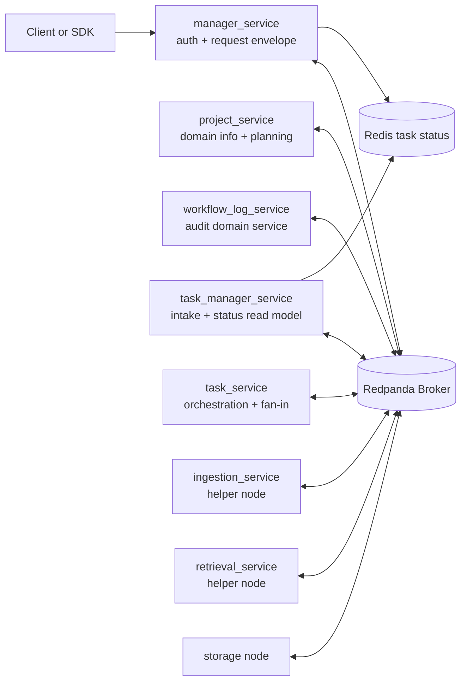
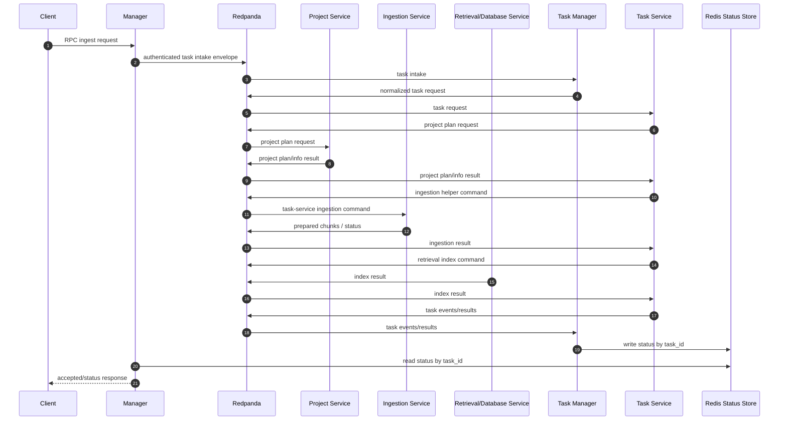
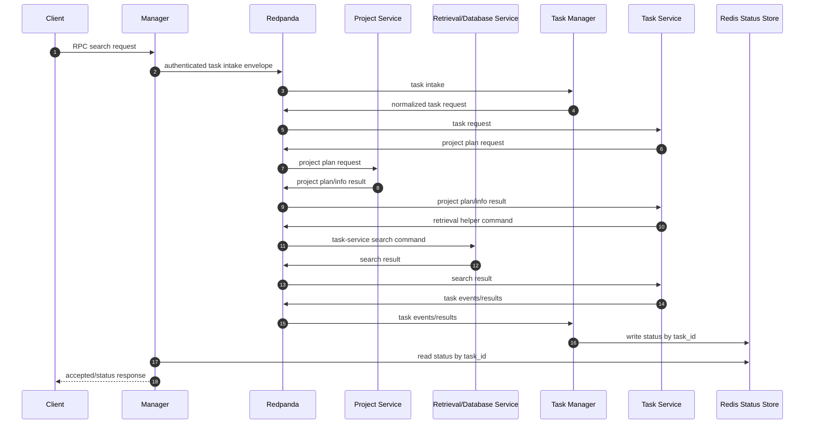
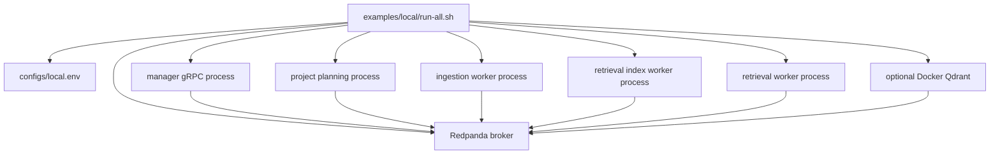

# Qdrant RAG Server

Qdrant RAG Server is a service-oriented information retrieval platform for
project-scoped documents. It ingests source material, normalizes and chunks it,
indexes it into retrieval backends, serves search/delete/status APIs, and keeps
workflow events auditable. LLM generation is optional; retrieval is the core.

The codebase has moved from an earlier compatibility RAG server toward
independently owned manager/auth, broker, domain services, helper nodes, task
manager, storage, database, and workflow services. The current local runner
starts that broker-first topology for development and smoke testing.

The target rule is strict: local and production use the same service topology
and code paths. Local only means all servers run on one machine. Runtime
communication should go through Redpanda, except manager task-status lookup by
`task_id` through Redis and narrow public health APIs. Do not use embedded
services, in-memory queues, SQLite queue substitutes, file-based communication,
or cross-service imports.

## What It Does

- Authenticates public requests through a manager/auth service and publishes
  request envelopes to the broker.
- Stores project configuration and visibility/scope rules in the project
  domain service.
- Accepts ingestion requests asynchronously and tracks ingestion-owned jobs.
- Parses, cleans, chunks, and prepares source content for retrieval indexing.
- Indexes and searches dense, sparse BM25, and hybrid retrieval data in Qdrant.
- Produces placement plans during project planning and stores placement records
  locally for future shard-aware routing.
- Supports optional reranking, object storage backup, response caching, and
  generation-provider wiring.
- Emits workflow events for ingestion and indexing lifecycle visibility.
- Runs locally through development scripts while the repo is being realigned
  toward independent local servers.

## Architecture



Storage, database, cache, Qdrant, and placement state are accessed through their
own service/node boundaries. They are not direct cross-service links in the
target runtime.
Redis is the task-status exception: task manager writes status by `task_id`,
manager reads Redis for status checks, and completed task keys expire by TTL.

The topic-level message graph is documented in
[docs/architecture.md](docs/architecture.md#message-communication-graph).

### Service Ownership

| Service | Owns | Should not own |
| --- | --- | --- |
| `manager_service` | Public auth/API envelope creation and broker publication | Business execution, helper calls, result aggregation |
| `project_service` | Project domain information, config, adapters, scope, and planning from task-service requests | Heavy ingestion or retrieval execution, task lifecycle aggregation, public-manager-triggered work |
| `ingestion_service` | Source fetch, parsing, normalization, chunking, ingest jobs, index publication | Task ownership or project policy |
| `retrieval_service` | Retrieval/database capability: embeddings, Qdrant access, indexing, search/delete, cache, raw lookup | Source parsing or project policy |
| `task_manager_service` | Task intake normalization, `task.requests` publication, Redis status read model updates from task events/results | Auth, parsing, retrieval execution, helper fan-in |
| `task_service` | Task lifecycle orchestration, project planning requests, helper dispatch, retries, fan-out/fan-in, final result aggregation | Client intake, Redis status storage, helper execution |
| `redis` | Fast task status by `task_id` with TTL for completed tasks | Message brokering or business execution |
| `workflow_log_service` | Event consumption and durable audit history | Blocking the ingest/search success path |
| `shared` | Narrow contracts, schemas, protocol clients, and generic utilities | Service-specific business logic, parent service classes, shared runtime frameworks |

## Message Flows

### Ingest And Index



### Search



### Target Local Server Shape



Local scripts start the broker-first topology only. Removed compatibility modes
such as embedded local queues, project gRPC sidecars, and HTTP retrieval
transports are no longer part of the supported runtime.

Placement status: local project planning creates `placement_plan` payloads and
stores placement records in a SQLite registry. Retrieval indexing/search/delete
now resolve placement targets to Qdrant stores, write primary plus replica
targets, search bucketed targets with primary-to-replica failover, merge hits by
score, and namespace search caches by placement scope. Placement policies and
versioned rebalance states are persisted locally. Data migration/reindex
orchestration and multi-endpoint smoke coverage remain pending.

## Repository Layout

```text
configs/              service-separated config folders, profile variants, env examples
manager_service/      public auth/API envelope creation
task_manager_service/ task intake normalization and Redis status read model
task_service/         task orchestration, retries, fan-in, dead letters
project_service/      project config, adapters, scope, planning
ingestion_service/    source handling, parsing, chunking, jobs, worker API
retrieval_service/    retrieval API, indexing, embeddings, Qdrant, cache
workflow_log_service/ workflow event sink and audit storage
memory_service/       reserved future service boundary
shared/               service-neutral contracts, schemas, clients, generic utilities
docs/                 architecture, contracts, roadmap, section designs
examples/local/       local start/stop scripts and runner docs
tests/                service-owned unit/boundary tests plus integration smoke coverage
```

## Quick Start

Use Python 3.12 or newer. If you use the existing local conda environment:

```bash
source /home/bruce/miniconda3/etc/profile.d/conda.sh
conda activate evo
```

Install development dependencies:

```bash
python -m pip install -e ".[dev]"
```

Create a local env file under `configs`:

```bash
cp configs/local.env.example configs/local.env
```

Start the local stack:

```bash
examples/local/run-all.sh --reset --init
```

For a first run, add `--smoke` to seed the project and verify the public health,
ingest, completed-status, and strict search flow before the command succeeds:

```bash
examples/local/run-all.sh --reset --smoke
```

Stop it:

```bash
examples/local/stop-all.sh --clean
```

Useful local variants:

```bash
examples/local/run-all.sh --init --no-server
examples/local/run-all.sh --infra-only
examples/local/run-all.sh --reset --init --no-qdrant
```

The default local embedding provider may download a sentence-transformers model
from Hugging Face. In restricted-network environments, use
`--embedding-provider deterministic --embedding-model deterministic-hash
--embedding-dimension 384` for smoke checks, pre-cache the model, or switch to
an OpenAI-compatible remote embedding provider with `RAG_EMBEDDING_API_KEY`.

Local broker topics and Redis task-status keys use the
`qdrant-rag-local.` / `qdrant-rag-local:task:` namespaces by default, so the
runner can safely reuse Kafka-compatible and Redis services already listening
on the standard local ports. Override `BROKER_TOPIC_PREFIX` or
`REDIS_TASK_STATUS_KEY_PREFIX` when a different namespace is required.

## Configuration

All config code, profile defaults, and env examples live under `./configs`.

- Stable active entrypoint: `configs/config.py`
- Local profile: `configs/config_local.py`
- Production profile: `configs/config_production.py`
- Testing profile: `configs/config_testing.py`
- Local env example: `configs/local.env.example`
- Production env example: `configs/production.env.example`

Default load order:

1. Python profile defaults
2. Profile env file such as `configs/local.env`
3. Component env files
4. Process environment variables

Select production without copying files:

```bash
RAG_CONFIG_PROFILE=production python -m manager_service.worker
```

`manager_service.server.app` is an injection-only manager bootstrap used by
deployment composition. Start runnable manager processes through
`manager_service.worker` or `examples/local/run-all.sh`.

Deployment systems that require one active config file can promote a profile:

```bash
cp configs/config_production.py configs/config.py
cp configs/production.env.example configs/production.env
```

Secrets should stay in uncommitted env files or deployment environment
variables, not in committed Python config modules.

Validate production settings without starting services:

```python
from configs import load_settings, validate_settings_or_raise

settings = load_settings(profile="production")
validate_settings_or_raise(settings, profile="production")
```

## Current Status

Implemented and tested locally:

- Manager task-intake publication and Redis-backed task status lookup.
- Task manager and task service broker orchestration.
- Ingestion job acceptance, preparation metadata, and helper command handling.
- Retrieval transport contracts, retrieval API handler, and broker helper
  transport.
- Standalone ingestion worker, retrieval index worker, and retrieval worker
  startup paths.
- Retrieval placement core, local placement registry, and placement-plan
  propagation through project planning, retrieval API contracts, and indexing
  messages, plus placement-aware indexing/search/delete execution.
- Config profile variants and local/production env workflows under `configs`.

Known migration limits:

- The external compatibility `RagService` gRPC API is still present at the
  manager edge while internal services communicate through broker messages.
- Task service has immediate or scheduled retries, helper attempt propagation,
  dead-letter publication, durable lease/backoff state fields, and an active
  SQLite-backed recovery loop for expired leases and due scheduled retries.
- Most service-owned tests are split by service folder under `tests/`; a few
  broad configuration, runner, and cross-service guards remain at the root.
- Placement execution and policy/state persistence are implemented locally, but
  migration/reindex orchestration and multi-endpoint smoke tests are still
  pending.
- Full local smoke requires Docker access for Redpanda, Redis, and Qdrant. The
  deterministic embedding provider gives smoke/offline runs a no-download path;
  semantic local embeddings still require a cached or downloadable model.

## Development

Run the full test suite:

```bash
pytest -q
```

Run focused local runner checks:

```bash
bash -n examples/local/run-all.sh
bash -n examples/local/stop-all.sh
examples/local/run-all.sh --no-server --no-qdrant --project-id smoke --project-type website
```

GitHub Actions runs the full non-live pytest suite, package compile check, and
local runner shell syntax check on pushes and pull requests. The workflow can
also be triggered manually to run Docker-backed live-infra checks or the full
local ingest/search smoke.

Runtime files created by the local runner:

- `.run/logs/`
- `.run/*.pid`
- `.run/state.env`
- `.run/data/`

## Documentation

- [Documentation index](docs/README.md)
- [Architecture](docs/architecture.md)
- [Service boundaries](docs/service-boundaries.md)
- [Ideal system boundary](docs/boundary.md)
- [Contracts](docs/contracts.md)
- [Implementation roadmap](docs/implementation-roadmap.md)
- [Section design index](docs/design/section-design-index.md)
- [Configuration profiles](configs/README.md)
- [Local runner](examples/local/README.md)
- [Progress log](progress.md)

## Design Principles

- Keep public auth and request-envelope creation in the manager.
- Keep each service responsible for its own state and implementation details.
- Use public APIs and Redpanda contracts instead of cross-importing service
  internals.
- Do not share parent service classes, inherited server frameworks, or runtime
  abstractions between servers.
- Put all configs, env examples, and keys under `./configs`.
- Keep the core retrieval path usable without optional generation.
