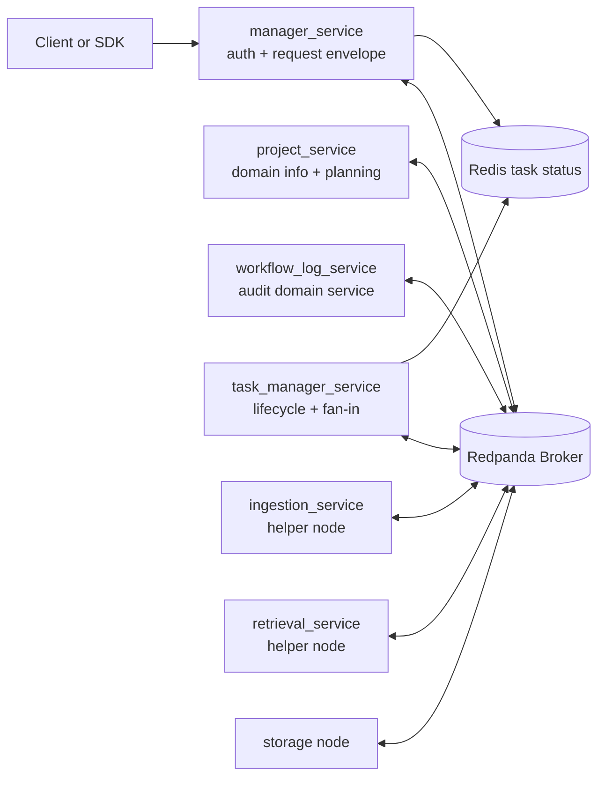
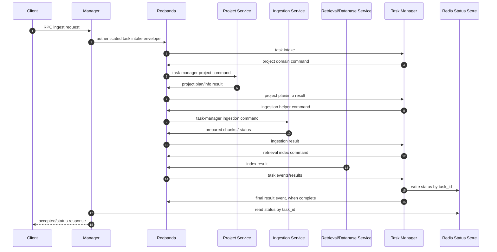
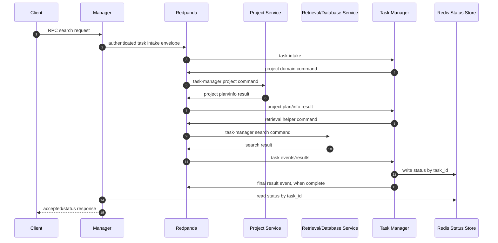
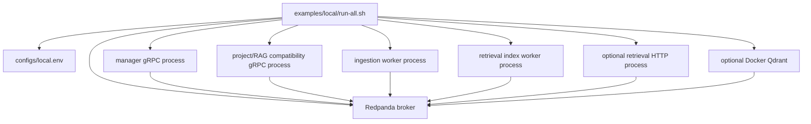

# Qdrant RAG Server

Qdrant RAG Server is a service-oriented information retrieval platform for
project-scoped documents. It ingests source material, normalizes and chunks it,
indexes it into retrieval backends, serves search/delete/status APIs, and keeps
workflow events auditable. LLM generation is optional; retrieval is the core.

The codebase is in an active migration from an earlier compatibility RAG server
into independently owned manager/auth, broker, domain services, helper nodes,
task manager, storage, database, and workflow services. The current local runner
is usable for development and smoke testing, but it is not yet fully aligned
with the target microservice standard.

The target rule is strict: local and production use the same service topology
and code paths. Local only means all servers run on one machine. Runtime
communication should go through Redpanda, except manager task-status lookup by
`task_id` through Redis and narrow public health APIs. Do not use embedded
services, in-memory queues, SQLite queue substitutes, file-based communication,
or cross-service imports.

## What It Does

- Authenticates public requests through a manager/auth service and publishes
  request envelopes to the broker.
- Stores project configuration and visibility/scope rules in the project
  domain service.
- Accepts ingestion requests asynchronously and tracks ingestion-owned jobs.
- Parses, cleans, chunks, and prepares source content for retrieval indexing.
- Indexes and searches dense, sparse BM25, and hybrid retrieval data in Qdrant.
- Produces placement plans during project planning and stores placement records
  locally for future shard-aware routing.
- Supports optional reranking, object storage backup, response caching, and
  generation-provider wiring.
- Emits workflow events for ingestion and indexing lifecycle visibility.
- Runs locally through development scripts while the repo is being realigned
  toward independent local servers.

## Architecture



Storage, database, cache, Qdrant, and placement state are accessed through their
own service/node boundaries. They are not direct cross-service links in the
target runtime.
Redis is the task-status exception: task manager writes status by `task_id`,
manager reads Redis for status checks, and completed task keys expire by TTL.

The topic-level message graph is documented in
[docs/architecture.md](docs/architecture.md#message-communication-graph).

### Service Ownership

| Service | Owns | Should not own |
| --- | --- | --- |
| `manager_service` | Public auth/API envelope creation and broker publication | Business execution, helper calls, result aggregation |
| `project_service` | Project domain information, config, adapters, scope, planning from task-manager-issued commands | Heavy ingestion or retrieval execution, task lifecycle aggregation, public-manager-triggered work |
| `ingestion_service` | Source fetch, parsing, normalization, chunking, ingest jobs, index publication | Task ownership or project policy |
| `retrieval_service` | Retrieval/database capability: embeddings, Qdrant access, indexing, search/delete, cache, raw lookup | Source parsing or project policy |
| `task_manager_service` | Task lifecycle, domain dispatch, helper dispatch, fan-out/fan-in, Redis status updates, final result aggregation | Auth, parsing, retrieval execution |
| `redis` | Fast task status by `task_id` with TTL for completed tasks | Message brokering or business execution |
| `workflow_log_service` | Event consumption and durable audit history | Blocking the ingest/search success path |
| `shared` | Narrow contracts, schemas, protocol clients, and generic utilities | Service-specific business logic, parent service classes, shared runtime frameworks |

## Message Flows

### Ingest And Index



### Search



### Target Local Server Shape



Current scripts still contain compatibility modes and local queue shortcuts.
Those are migration scaffolding, not the final local runtime.

Placement status: local project planning creates `placement_plan` payloads and
stores placement records in a SQLite registry. Retrieval indexing/search/delete
now resolve placement targets to Qdrant stores, write primary plus replica
targets, search bucketed targets with primary-to-replica failover, merge hits by
score, and namespace search caches by placement scope. Placement policies and
versioned rebalance states are persisted locally. Data migration/reindex
orchestration and multi-endpoint smoke coverage remain pending.

`--external-retrieval-http` currently keeps manager project planning local and
only moves retrieval execution to the HTTP service. Do not combine it with
`--external-project-service` or `--split-services` until the project
config/scope API is extracted.

## Repository Layout

```text
configs/              service-separated config folders, profile variants, env examples
manager_service/      public auth/API envelope creation
project_service/      project config, adapters, scope, compatibility app
ingestion_service/    source handling, parsing, chunking, jobs, worker API
retrieval_service/    retrieval API, indexing, embeddings, Qdrant, cache
workflow_log_service/ workflow event sink and audit storage
memory_service/       reserved future service boundary
shared/               service-neutral contracts, schemas, clients, generic utilities
docs/                 architecture, contracts, roadmap, section designs
examples/local/       local start/stop scripts and runner docs
tests/                unit, boundary, and smoke coverage; must be split by service
```

## Quick Start

Use Python 3.12 or newer. If you use the existing local conda environment:

```bash
source /home/bruce/miniconda3/etc/profile.d/conda.sh
conda activate evo
```

Install development dependencies:

```bash
python -m pip install -e ".[dev]"
```

Create a local env file under `configs`:

```bash
cp configs/local.env.example configs/local.env
```

Start the local stack:

```bash
examples/local/run-all.sh --reset --init
```

Stop it:

```bash
examples/local/stop-all.sh --clean
```

Useful local variants:

```bash
examples/local/run-all.sh --init --no-server
examples/local/run-all.sh --reset --init --no-qdrant
examples/local/run-all.sh --reset --init --external-ingestion
examples/local/run-all.sh --reset --init --split-services
examples/local/run-all.sh --reset --init --external-retrieval-http
```

The default local embedding provider may download a sentence-transformers model
from Hugging Face. In restricted-network environments, pre-cache the model or
switch to an OpenAI-compatible remote embedding provider with
`RAG_EMBEDDING_API_KEY`.

## Configuration

All config code, profile defaults, and env examples live under `./configs`.

- Stable active entrypoint: `configs/config.py`
- Local profile: `configs/config_local.py`
- Production profile: `configs/config_production.py`
- Testing profile: `configs/config_testing.py`
- Local env example: `configs/local.env.example`
- Production env example: `configs/production.env.example`

Default load order:

1. Python profile defaults
2. Profile env file such as `configs/local.env`
3. Component env files
4. Process environment variables

Select production without copying files:

```bash
RAG_CONFIG_PROFILE=production python -m local_runtime.manager_app
```

`manager_service.server.app` is now an injection-only manager bootstrap. The
temporary local compatibility composition lives in `local_runtime.manager_app`
until all services run as fully independent servers.

Deployment systems that require one active config file can promote a profile:

```bash
cp configs/config_production.py configs/config.py
cp configs/production.env.example configs/production.env
```

Secrets should stay in uncommitted env files or deployment environment
variables, not in committed Python config modules.

Validate production settings without starting services:

```python
from configs import load_settings, validate_settings_or_raise

settings = load_settings(profile="production")
validate_settings_or_raise(settings, profile="production")
```

## Current Status

Implemented and tested locally:

- Manager client contracts for ingestion and retrieval.
- Ingestion job acceptance, preparation metadata, and status/control API.
- Retrieval transport contracts, retrieval API handler, queue transport, and
  retrieval HTTP transport.
- Standalone ingestion worker, retrieval index worker, and retrieval HTTP
  server startup paths.
- Local split ingestion-to-index smoke coverage with SQLite queues.
- Retrieval placement core, local placement registry, and placement-plan
  propagation through project planning, retrieval API contracts, and indexing
  messages, plus placement-aware indexing/search/delete execution.
- Config profile variants and local/production env workflows under `configs`.

Known migration limits:

- The external compatibility `RagService` gRPC API is still present while
  internal services are split.
- Some manager composition still adapts project/RAG compatibility clients until
  independent project config/scope APIs are extracted.
- Redpanda is the broker target for both local and production, but the adapter
  and runner integration are still pending.
- Retries, leases, attempt counts, backoff, and dead-letter queues are not in
  scope for the current broker phase.
- Tests are not yet separated by service under `tests/`.
- Some config folders exist, but config separation is not complete for every
  service and node.
- Placement execution and policy/state persistence are implemented locally, but
  migration/reindex orchestration and multi-endpoint smoke tests are still
  pending.
- Live Qdrant plus local embedding startup depends on Docker access and model
  availability.

## Development

Run the full test suite:

```bash
pytest -q
```

Run focused local runner checks:

```bash
bash -n examples/local/run-all.sh
bash -n examples/local/stop-all.sh
examples/local/run-all.sh --no-server --no-qdrant --project-id smoke --project-type website
```

Runtime files created by the local runner:

- `.run/logs/`
- `.run/*.pid`
- `.run/state.env`
- `.run/data/`

## Documentation

- [Documentation index](docs/README.md)
- [Architecture](docs/architecture.md)
- [Service boundaries](docs/service-boundaries.md)
- [Ideal system boundary](docs/boundary.md)
- [Contracts](docs/contracts.md)
- [Implementation roadmap](docs/implementation-roadmap.md)
- [Section design index](docs/design/section-design-index.md)
- [Configuration profiles](configs/README.md)
- [Local runner](examples/local/README.md)
- [Progress log](progress.md)

## Design Principles

- Keep public auth and request-envelope creation in the manager.
- Keep each service responsible for its own state and implementation details.
- Use public APIs and Redpanda contracts instead of cross-importing service
  internals.
- Do not share parent service classes, inherited server frameworks, or runtime
  abstractions between servers.
- Put all configs, env examples, and keys under `./configs`.
- Keep the core retrieval path usable without optional generation.
