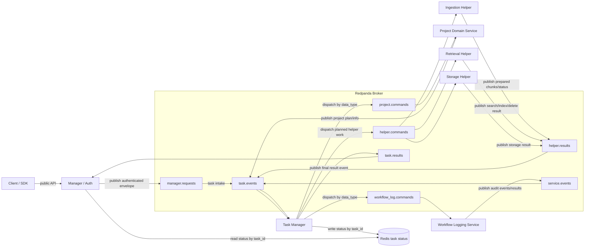

# Architecture

The project is moving from one compatibility RAG server toward independent
microservice servers. Each server must have its own top-level workspace,
runtime entrypoint, config ownership, tests, deployment definition, and service
implementation.

Local development and production must use the same service topology and code
paths. Local only means the same servers run on one machine with local
addresses. It must not use embedded services, in-memory queues, SQLite queues as
broker substitutes, file-based service communication, or direct imports into
another service's internals.

Redpanda is the broker target for all runtime node-to-node communication. Except
for client-to-manager public API calls, manager-to-Redis task status reads, and
private service-to-owned-storage access, nodes should not talk directly to each
other. Redis is the small task-status store: task manager writes status by
`task_id`, manager reads it for status checks, and completed task keys expire by
TTL. Retry, lease/claim timeout, attempt-count, backoff, and dead-letter
behavior are out of scope for the current phase.

## Service Map

```text
clients
  -> manager_service server (auth/API envelope)
       -> Redpanda broker

Redpanda broker
  -> task_manager_service server

task_manager_service server
  -> Redpanda broker for domain task commands
  -> Redis task-status store

Redpanda broker
  -> project_service server, triggered by task manager commands
  -> workflow_log_service server, triggered by task manager commands/events
  -> memory_service server or other domain services, triggered by task manager commands

domain services
  -> Redpanda broker

Redpanda broker
  -> ingestion_service worker servers, triggered by task manager commands
  -> storage helper nodes, triggered by task manager commands
  -> retrieval_service API/index worker servers, triggered by task manager commands
  -> other helper nodes, triggered by task manager commands

helper nodes
  -> Redpanda broker

task_manager_service server
  -> Redis task-status store
  -> Redpanda broker for final-result events

manager_service server
  -> Redis task-status store for status checks by task_id
```

## Current Ownership

- `manager_service`: public API/auth boundary and authenticated request
  envelope publication to the broker.
- `project_service`: project config, adapters, scope construction, retrieval filter intent, and current gRPC compatibility app.
- `ingestion_service`: source loading, document routing, parsing, cleaning,
  chunking, neutral ingestion output, and queued ingest request consumption.
- `retrieval_service`: embeddings, Qdrant, BM25/hybrid retrieval, ranking, indexing, cache, storage, and health.
- `workflow_log_service`: lifecycle-event consumer, repository, and local
  service app.
- `task_manager_service`: target service for task lifecycle, fan-out/fan-in,
  Redis status updates, and final result aggregation. This is not implemented yet.
- `redis`: small task-status store keyed by `task_id`, written by task manager
  and read by manager for client status checks. Completed task keys must expire
  by TTL.
- `shared`: stable contracts, schemas, protocol clients, and generic utilities
  only. It must not contain parent service classes, inherited server frameworks,
  orchestration, or service-specific business logic.

`memory_service` remains reserved. `workflow_log_service` now provides the
local sink for ingest lifecycle events, durable SQLite storage, and a service
composition root for future independent deployment.

## Communication

The target runtime is broker-first. The manager should not directly call project,
workflow, ingestion, retrieval, storage, or task manager internals.

Normal request flow:

```text
client
  -> manager/auth server
  -> broker
  -> task manager
  -> broker
  -> domain service, such as project service or workflow logging service
  -> broker
  -> task manager
  -> broker
  -> helper nodes, such as ingestion, storage, retrieval, or other helpers
  -> broker
  -> task manager
```

Synchronous public APIs are limited to bounded API surfaces such as the manager
entrypoint, manager status lookup by `task_id`, and health checks. Service work
and cross-service coordination move through Redpanda topics. Task status lookup
is served from Redis.

Current manager dispatch uses service-specific client protocols from
`manager_service.clients`. This is now legacy compatibility relative to the
corrected target. It must be replaced by authenticated request publication to
Redpanda, Redis-backed task status reads, and task result consumption only when
final result events are needed.

Retrieval search, delete, and raw-document calls now have transport-neutral
command and response contracts under `retrieval_service.retrieval.contracts`.
In the target topology, these become helper-node command/result messages behind
Redpanda or retrieval-owned public APIs used only at the retrieval boundary.
`RetrievalApiHandler` provides the matching transport-neutral dispatch layer:
payload mappings in, retrieval app calls, response-envelope mappings out.
`retrieval_service.server` now provides the retrieval-owned server context that
future network transports can wrap without depending on the compatibility
`RagService` API.
For the target runtime, retrieval work should be requested through broker-backed
helper commands. Direct in-process retrieval execution and manager/project direct
retrieval calls are compatibility paths, not the final local runtime.

For ingest, the task manager first sends a domain command to a service such as
project service. The domain service gathers project information and publishes a
domain plan/result to Redpanda. The task manager consumes that result and then
dispatches helper commands through Redpanda. The ingestion helper consumes its
command, creates ingestion-owned records, prepares content generically, and
publishes prepared chunks/results back to Redpanda. Retrieval and storage
helpers consume task-manager-issued commands and publish results back to the
broker. The task manager consumes those events and owns lifecycle, fan-out,
fan-in, status, and final result aggregation.

Asynchronous work should use Redpanda topics:

- task intake topics from manager to task manager
- domain command/result topics for project, workflow log, memory, and other
  domain services
- helper command/result topics for ingestion, storage, retrieval, indexing, and
  other helper nodes
- task manager topics for task lifecycle, status, fan-out/fan-in, and results
- service event topics for workflow logging

Existing local/in-process/SQLite queue adapters are migration scaffolding. They
must not remain in the intended local or production runtime.

## Message Communication Graph



Every arrow between runtime nodes terminates at a Redpanda topic. Services do
not call each other directly. Redis is the task-status exception: task manager
writes status by `task_id`, manager reads it for status checks, and completed
task keys expire by TTL. Topic names are placeholders for the contract split;
the important rule is that all node-to-node messages pass through the broker.

## Folder And Import Boundaries

- Each independent server belongs in its own top-level folder.
- Services must not import another service's internal modules, repositories,
  handlers, runtime objects, or implementation details.
- There must be no shared parent classes, base service classes, inherited server
  frameworks, or cross-service runtime abstractions.
- Shared packages may hold stable contracts, schemas, protocol clients, and
  small generic utilities only.
- Service-specific config belongs under that service's `configs/` subfolder.
- Service-specific tests belong under that service's `tests/` subfolder.

## Migration Order

1. Keep external `RagService` stable.
2. Define broker envelopes and topics for manager/auth intake, task-manager
   domain commands, domain plan/results, helper commands/results, service
   events, and task manager status.
3. Add independent task manager service ownership for lifecycle, dispatch,
   fan-out/fan-in, status, and final result aggregation.
4. Convert manager dispatch from direct service clients to broker publication
   of task intake only.
5. Convert project/workflow/memory services into broker-consumed domain task
   servers triggered by task manager messages.
6. Convert ingestion, storage, retrieval, and other helpers into broker-consumed
   helper nodes triggered by task manager messages.
7. Replace local queue shortcuts with Redpanda for local and production.
8. Restructure tests and configs by service.
9. Remove legacy duplicate schemas and compatibility shims once callers migrate.
