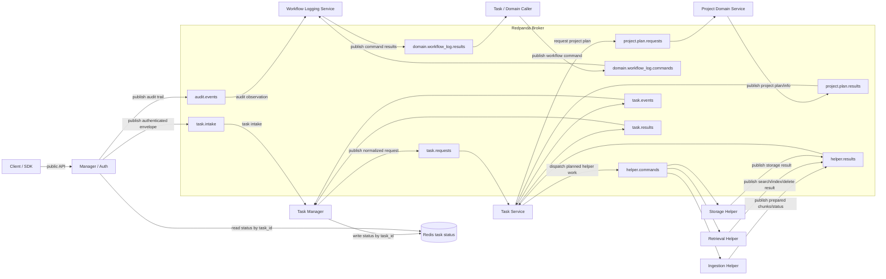

# Architecture

The project is moving from one compatibility RAG server toward independent
microservice servers. Each server must have its own top-level workspace,
runtime entrypoint, config ownership, tests, deployment definition, and service
implementation.

Local development and production must use the same service topology and code
paths. Local only means the same servers run on one machine with local
addresses. It must not use embedded services, in-memory queues, SQLite queues as
broker substitutes, file-based service communication, or direct imports into
another service's internals.

Redpanda is the broker target for all runtime node-to-node communication. Except
for client-to-manager public API calls, manager-to-Redis task status reads, and
private service-to-owned-storage access, nodes should not talk directly to each
other. Redis is the small task-status store: task manager writes status by
`task_id`, manager reads it for status checks, and completed task keys expire by
TTL. The current task-service path supports helper attempts, immediate retries,
scheduled retries, dead letters, durable lease/backoff fields, and DB-backed
recovery for expired helper leases.

## Service Map

```text
clients
  -> manager_service server (auth/API envelope)
       -> Redpanda broker

Redpanda broker
  -> task_manager_service server
  -> task_service server

task_manager_service server
  -> Redpanda broker for normalized task requests
  -> Redis task-status store

task_service server
  -> Redpanda broker for project plan requests, helper commands, task events, and final results

Redpanda broker
  -> project_service server, triggered by task service planning requests
  -> workflow_log_service worker, triggered by domain commands and audit events
  -> memory_service server or other domain services, triggered by task manager commands

domain services
  -> Redpanda broker

Redpanda broker
  -> ingestion_service worker servers, triggered by task service commands
  -> storage helper nodes, triggered by task service commands
  -> retrieval_service API/index worker servers, triggered by task service commands
  -> other helper nodes, triggered by task service commands

helper nodes
  -> Redpanda broker

task_manager_service server
  -> Redis task-status store
  -> Redpanda broker for final-result events

manager_service server
  -> Redis task-status store for status checks by task_id
```

## Current Ownership

- `manager_service`: public API/auth boundary and authenticated request
  envelope publication to the broker.
- `project_service`: project config, adapters, scope construction, retrieval filter intent, and project planning.
- `ingestion_service`: source loading, document routing, parsing, cleaning,
  chunking, neutral ingestion output, and helper command handling.
- `retrieval_service`: embeddings, Qdrant, BM25/hybrid retrieval, ranking, indexing, cache, storage, and health.
- `workflow_log_service`: audit event sink, domain command handler,
  repository, and worker process.
- `task_manager_service`: normalized task request publication and Redis
  task-status read-model updates from task events/results.
- `task_service`: task lifecycle orchestration, project planning requests,
  helper dispatch, retry/fan-in/dead-letter handling, explicit SQLite
  execution/step/attempt/result state, and final result publication.
- `redis`: small task-status store keyed by `task_id`, written by task manager
  and read by manager for client status checks. Completed task keys must expire
  by TTL.
- `shared`: stable contracts, schemas, protocol clients, and generic utilities
  only. It must not contain parent service classes, inherited server frameworks,
  orchestration, or service-specific business logic.

`memory_service` remains reserved. `workflow_log_service` now provides the
local sink for ingest lifecycle events, durable SQLite storage, and a service
composition root for future independent deployment.

## Communication

The target runtime is broker-first. The manager should not directly call project,
workflow, ingestion, retrieval, storage, or task manager internals.

Normal request flow:

```text
client
  -> manager/auth server
  -> broker
  -> task manager
  -> broker
  -> task service
  -> broker
  -> domain service, such as project service or workflow logging service
  -> broker
  -> task service
  -> broker
  -> helper nodes, such as ingestion, storage, retrieval, or other helpers
  -> broker
  -> task service
  -> broker
  -> task manager
```

Synchronous public APIs are limited to bounded API surfaces such as the manager
entrypoint, manager status lookup by `task_id`, and health checks. Service work
and cross-service coordination move through Redpanda topics. Task status lookup
is served from Redis.

Current manager dispatch publishes authenticated request envelopes to Redpanda.
Status reads are Redis-backed by `task_id`; search may wait for a task result
within the public gRPC deadline.

Retrieval search, delete, and raw-document calls have transport-neutral command
and response contracts under `retrieval_service.retrieval.contracts`.
`RetrievalApiHandler` provides the dispatch layer behind the broker helper:
payload mappings in, retrieval app calls, response-envelope mappings out.
Retrieval work is requested through broker-backed helper commands.

For ingest, the task manager publishes a normalized task request to the task
service. The task service sends a project planning request to project service.
The project service gathers project information and publishes a project plan
result to Redpanda. The task service consumes that result and then dispatches
helper commands through Redpanda. The ingestion helper consumes its
command, creates ingestion-owned records, prepares content generically, and
publishes prepared chunks/results back to Redpanda. Retrieval and storage
helpers consume task-service-issued commands and publish results back to the
broker. The task service owns lifecycle orchestration, fan-out, fan-in, retries,
dead letters, and final result aggregation; task manager consumes task
events/results and updates Redis.

Asynchronous work should use Redpanda topics:

- task intake topics from manager to task manager
- task request topics from task manager to task service
- project plan request/result topics for project service
- helper command/result topics for ingestion, storage, retrieval, indexing, and
  other helper nodes
- task service topics for task lifecycle events, fan-out/fan-in, and results
- passive audit event topics for workflow logging

Local/in-process/SQLite queue adapters have been removed from the intended
local and production runtime.

## Message Communication Graph



Every arrow between runtime nodes terminates at a Redpanda topic. Services do
not call each other directly. Redis is the task-status exception: task manager
writes status by `task_id`, manager reads it for status checks, and completed
task keys expire by TTL. Topic names are placeholders for the contract split;
the important rule is that all node-to-node messages pass through the broker.

## Folder And Import Boundaries

- Each independent server belongs in its own top-level folder.
- Services must not import another service's internal modules, repositories,
  handlers, runtime objects, or implementation details.
- There must be no shared parent classes, base service classes, inherited server
  frameworks, or cross-service runtime abstractions.
- Shared packages may hold stable contracts, schemas, protocol clients, and
  small generic utilities only.
- Service-specific config belongs under that service's `configs/` subfolder.
- Service-specific tests belong under that service's `tests/` subfolder.

## Migration Order

1. Keep external `RagService` stable.
2. Define broker envelopes and topics for manager/auth intake, task requests,
   project plan requests/results, helper commands/results, task events/results,
   and service events.
3. Add independent task manager status read-model ownership and task service
   lifecycle orchestration, fan-out/fan-in, retries, and final aggregation.
4. Keep manager dispatch limited to broker publication of task intake and
   Redis-backed status reads.
5. Convert project/workflow/memory services into broker-consumed domain task
   servers triggered by task manager messages.
6. Keep ingestion, storage, retrieval, indexing, and other helpers as
   broker-consumed helper nodes triggered by task service messages.
7. Keep Redpanda as the local and production runtime broker.
8. Restructure tests and configs by service.
9. Remove legacy duplicate schemas and compatibility shims once callers migrate.
