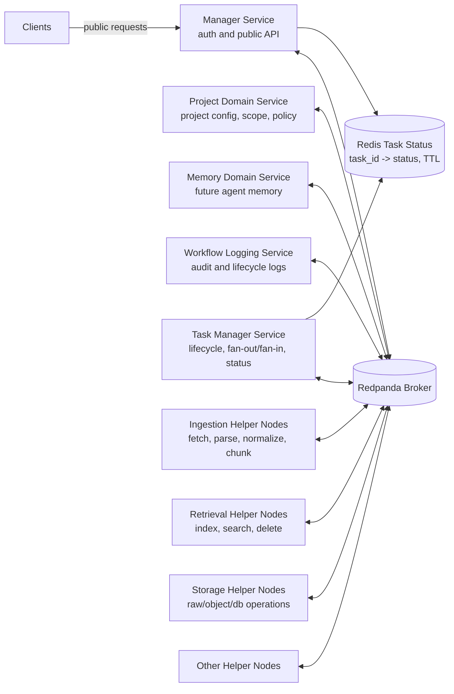
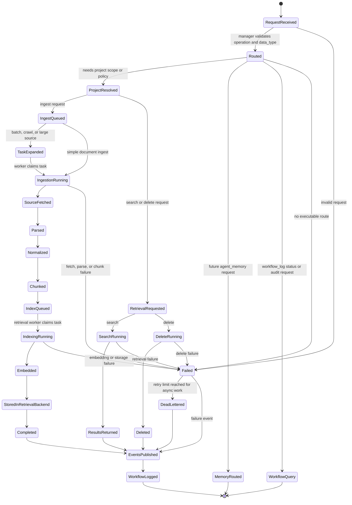

# Ideal System Boundary

This document defines the intended end-state shape of the project. It is not a
snapshot of the current implementation. It describes the target boundaries,
inputs, outputs, service ownership, and communication rules for a multi-service
information storing and retrieval system.

The system's main purpose is to accept information from multiple sources, route
that information through the correct ingestion workflow, normalize and index it,
store the durable results, and make the information searchable and retrievable
through stable APIs.

## Design Goals

- Keep every server independently deployable, testable, and replaceable.
- Keep every independent server in its own independent top-level workspace.
- Prevent services from importing another service's internals.
- Avoid shared parent classes, inherited service frameworks, and shared runtime
  abstractions between servers.
- Keep public authentication and request-envelope creation centralized in the
  manager service.
- Keep service ownership narrow: each service owns one category of decisions and
  state.
- Use Redpanda topics for long-running work so request handling remains
  asynchronous and resilient.
- Treat ingestion, indexing, storage, retrieval, and workflow logging as separate
  concerns.
- Preserve typed contracts between services so implementations communicate
  through public APIs or Redpanda topics without changing domain logic.

## Ideal Repository Shape

The ideal project layout is folder-oriented by service. Each service folder
contains the files needed to run that service, plus its local schemas, clients,
handlers, configuration loader, and tests.

```text
qdrant_rag_server/
  manager_service/
    server/
    routing/
    clients/
    schemas/
    config/

  project_service/
    server/
    adapters/
    config/
    schemas/

  ingestion_service/
    server/
    routing/
    handlers/
    source/
    normalization/
    chunking/
    jobs/
    storage/
    schemas/

  retrieval_service/
    server/
    retrieval/
    indexing/
    embedding/
    ranking/
    storage/
    llm/
    health/
    schemas/

  memory_service/
    server/
    schemas/
    storage/

  workflow_log_service/
    server/
    consumer/
    repository/
    schemas/

  task_manager_service/
    server/
    consumer/
    repository/
    schemas/

  shared/
    contracts/
    queue/
    errors/
    telemetry/

  configs/
    manager/
    project/
    ingestion/
    retrieval/
    memory/
    workflow_log/
    broker/
    sqlite/

  docs/
  tests/
    manager/
    project/
    ingestion/
    retrieval/
    workflow_log/
    broker/
    sqlite/
    integration/
  deployment/
  examples/
```

Service folders should not import another service's internals. Cross-service
access should happen through typed clients, queue messages, or transport DTOs
defined in the owning service or in `shared/contracts` when the contract is
truly service-neutral.

Shared code must not contain parent service classes, inherited server
frameworks, lifecycle managers, or runtime wiring shared across services. Shared
code is limited to stable contracts, schemas, protocol clients, and small
generic utilities.

Local development uses this same shape. All servers and nodes may run on the
same machine, but they must still communicate through Redpanda topics rather
than embedded calls, in-memory queues, SQLite queue substitutes, files, or direct
imports. The direct runtime exception is manager task-status lookup from Redis
by `task_id`; Redis is not the message broker.

## Service Ownership

### Manager Service

The manager is the only public entry point for normal client traffic. It owns
authentication, request validation, request classification, and correlation/task
ID creation. It publishes authenticated request envelopes to Redpanda.

Ideal responsibilities:

- Accept public API requests.
- Validate operation, `data_type`, tenant, project, user, and KB identifiers.
- Publish authenticated request envelopes to Redpanda.
- Return stable acknowledgements and task IDs.
- Read task status directly from Redis by `task_id` for client status checks.
- Return final results when Redis/task state shows the task has completed.

The manager should not parse documents, call Qdrant directly, create embeddings,
perform chunking, write service-owned databases, call helper nodes directly, or
aggregate helper results itself.

### Project Service

The project service owns project-specific configuration and visibility rules.
It resolves how a request should behave inside a project, but it does not own
heavy ingestion or retrieval implementation details.

Ideal responsibilities:

- Store and resolve project, user, KB, and scope configuration.
- Own source adapter configuration for project-bound sources.
- Build project-aware filters and retrieval intent.
- Provide project metadata to ingestion and retrieval services.
- Enforce project-level visibility and policy decisions.

### Ingestion Service

The ingestion service owns the transformation from source input to normalized,
index-ready content. It may run multiple specialized ingestion workers behind a
common queue contract.

Ideal responsibilities:

- Consume ingestion commands from queues.
- Fetch source material from files, URLs, raw text, object storage, or external
  connectors.
- Detect file type, MIME type, source type, and handler capability.
- Route the source to the correct ingestion handler.
- Parse documents into structured text, tables, metadata, and attachments when
  supported.
- Clean and normalize content.
- Chunk content into retrieval-ready units.
- Persist ingestion job state.
- Publish lifecycle events.
- Forward prepared chunks to indexing through a retrieval indexing command or
  indexing queue.

The ingestion service should not own vector database search behavior, ranking,
generation, or project route decisions.

### Task Manager Service

The task manager owns task intake normalization and the Redis status read model.
It sits after the manager task intake topic, not inside the public manager. It
keeps the manager simple and keeps execution orchestration out of the intake
boundary.

Ideal responsibilities:

- Consume authenticated task intake events from Redpanda.
- Create task IDs and publish normalized `task.requests`.
- Consume `task.events` and `task.results`.
- Keep Redis status current by `task_id`.
- Apply TTL to completed task status records in Redis.

The task manager should communicate through Redpanda topics and Redis status
keys only. It should avoid direct calls to parsers, vector stores, project
internals, helper nodes, or public manager handlers.

### Task Service

The task service owns task execution orchestration after task intake has been
normalized.

Ideal responsibilities:

- Consume `task.requests`.
- Request project plans through Redpanda.
- Dispatch helper commands to ingestion, retrieval, retrieval-index, storage,
  SQLite/database, or other helper nodes.
- Fan out helper work across specialized worker nodes.
- Fan in partial results and publish task lifecycle events and final task
  results.
- Own retries, leases, attempt counts, backoff, dead letters, and durable
  execution state.

### Retrieval Service

The retrieval service owns search, indexing into retrieval backends, embedding
integration, ranking, and retrieval-time storage access.

Ideal responsibilities:

- Consume task-service-issued indexing/search/delete commands.
- Generate dense embeddings and sparse representations.
- Enrich chunks with retrieval metadata.
- Upsert vectors and payloads into Qdrant or another retrieval backend.
- Maintain lexical, sparse, dense, and hybrid indexes.
- Execute search requests with filters, scoring, reranking, and cache lookup.
- Delete indexed documents and invalidate caches.
- Read raw document backups when retrieval responses need source material.
- Report retrieval health and index version status.

The retrieval service should not parse source documents or decide public request
routing.

### Database and Storage Services

Storage should be treated as a service boundary even when implemented by local
libraries. Durable persistence is owned by the service that understands the
state being stored.

Ideal storage ownership:

- Project service stores project configuration and visibility state.
- Ingestion service stores ingest jobs, source fetch metadata, and raw ingest
  artifacts when needed.
- Retrieval service stores vector payloads, indexes, retrieval caches, and raw
  document backups needed for retrieval.
- Workflow log service stores lifecycle events and audit records.
- Memory service stores agent memory records when that data type is enabled.

Database services should expose typed APIs or repository interfaces. Other
services should not reach into their tables or storage buckets directly.

### Workflow Log Service

The workflow log service owns lifecycle event consumption and audit history.

Ideal responsibilities:

- Consume service events from queue topics.
- Store durable workflow logs.
- Provide query APIs for task history, ingest history, and operational audit.
- Keep logging failure isolated from the success path of ingestion or retrieval.

### Memory Service

The memory service is reserved for long-lived agent memory and non-document
knowledge. It should be a separate service because memory records have different
lifecycles, permissions, ranking behavior, and deletion semantics from project
documents.

## Ideal Inputs

The system should accept typed public requests through the manager. Every input
must include enough routing metadata to identify the operation, data type, owner,
and desired behavior.

Common request envelope:

```json
{
  "operation": "ingest | search | delete | status",
  "data_type": "project_document | agent_memory | workflow_log",
  "project_id": "project identifier",
  "user_id": "user identifier",
  "kb_id": "knowledge-base identifier",
  "correlation_id": "optional caller-provided trace id",
  "payload": {}
}
```

Ingest payload examples:

```json
{
  "doc_id": "document identifier",
  "source_uri": "file, s3, http, or connector URI",
  "raw_text": "optional inline text",
  "raw_content": "optional encoded content",
  "metadata": {
    "filename": "example.pdf",
    "content_type": "application/pdf"
  },
  "policy": {
    "chunking": "section",
    "overwrite": true,
    "store_raw": true
  }
}
```

Search payload examples:

```json
{
  "query": "user search text",
  "filters": {
    "doc_id": "optional document filter",
    "tags": ["optional", "labels"]
  },
  "retrieval": {
    "mode": "dense | sparse | hybrid",
    "top_k": 10,
    "rerank": true
  }
}
```

Delete payload examples:

```json
{
  "doc_id": "document identifier",
  "delete_raw": true,
  "delete_indexes": true
}
```

Status payload examples:

```json
{
  "job_id": "ingestion or task job identifier"
}
```

## Ideal Outputs

Public responses should be stable even if internal transports change.

Async ingest acknowledgement:

```json
{
  "accepted": true,
  "job_id": "job identifier",
  "status": "pending",
  "correlation_id": "trace id"
}
```

Task or ingest status response:

```json
{
  "job_id": "job identifier",
  "status": "pending | running | completed | failed",
  "error": "nullable error message",
  "created_at": "timestamp",
  "updated_at": "timestamp"
}
```

Search response:

```json
{
  "query": "user search text",
  "results": [
    {
      "doc_id": "document identifier",
      "chunk_id": "chunk identifier",
      "score": 0.94,
      "text": "matched chunk text",
      "metadata": {}
    }
  ],
  "correlation_id": "trace id"
}
```

Delete response:

```json
{
  "deleted": true,
  "doc_id": "document identifier",
  "correlation_id": "trace id"
}
```

## Ideal Architecture

### System Architecture Graph



The graph shows the intended system boundary. Every server-to-server message
goes through Redpanda. The direct exceptions shown are client-to-manager public
API traffic and manager-to-Redis status lookup. Task manager writes Redis task
status by `task_id`, and completed task keys expire by TTL. Storage, database,
cache, Qdrant, and placement state are accessed through their own service/node
boundaries and are intentionally not drawn as direct cross-node links.

### Transition Diagram



The transition diagram describes state movement, not a single process. Public
requests first pass through the manager. Long-running states move into queues
and workers. Terminal states publish lifecycle events so workflow logging can
record both successful and failed work.

```text
clients
  -> manager_service
       -> Redpanda task intake
            -> task_manager_service
                 -> Redpanda domain command topics
                      -> project_service, workflow_log_service, memory_service, other domain services
                 -> Redpanda helper command topics
                      -> ingestion workers, retrieval workers, storage nodes, other helper nodes
                 -> Redis task status by task_id

domain result topics
  -> task_manager_service
       -> helper command topics
            -> helper result topics
                 -> task_manager_service
                      -> Redis task status and final-result topics

service event topics
  -> workflow_log_service
       -> workflow log database
```

The manager authenticates and accepts public requests, but it does not perform
the work or directly call/trigger domain/helper services. Work moves through
Redpanda topics. The task manager consumes manager task intake events, triggers
domain task servers, consumes domain plans/info, dispatches helper commands,
aggregates lifecycle/results, and writes task status to Redis. Domain services
gather service-specific information, helper nodes execute concrete work, and
each service writes to its owned stores.

## Communication Rules

### Synchronous Communication

Use synchronous calls only for bounded public or operational surfaces:

- client to manager public API
- manager to Redis task-status lookup by `task_id`
- service health endpoints
- local process lifecycle checks

Synchronous calls should have explicit timeouts, typed errors, and correlation
IDs. They should not hide long-running work or bypass the broker-first service
flow.

### Asynchronous Communication

Use Redpanda topics for work that can take variable time or needs backpressure:

- manager-authenticated task intake requests
- task-manager-issued normalized task requests
- task-service-issued project plan requests
- domain service info/planning responses
- task-service-issued helper commands for ingestion, storage, retrieval,
  indexing, and other nodes
- helper results
- task lifecycle, fan-out/fan-in, status, and final result messages
- lifecycle events
- cache invalidation events

Retries, leases, attempt counts, backoff, and dead-letter handling are outside
the current broker scope.

Queue messages should use a consistent envelope:

```json
{
  "topic": "task.intake",
  "key": "project:user:document",
  "headers": {
    "correlation_id": "trace id",
    "project_id": "project identifier",
    "user_id": "user identifier"
  },
  "payload": {}
}
```

The current broker phase should support:

- bounded worker concurrency
- durable messages in production
- at-least-once delivery
- idempotent consumers
- per-topic metrics
- correlation IDs across all messages
- backpressure when downstream services are unhealthy

## Core Topics

Recommended topic names:

| Topic | Producer | Consumer | Purpose |
| --- | --- | --- | --- |
| `task.intake` | manager service | task manager | Deliver authenticated public requests after auth/validation. |
| `task.requests` | task manager | task service | Deliver normalized task requests for orchestration. |
| `task.events` | task service | task manager | Report task lifecycle and step updates for Redis status. |
| `task.results` | task service | task manager | Publish final success/failure task results. |
| `project.plan.requests` | task service | project service | Trigger project-document planning/info lookup. |
| `project.plan.results` | project service | task service | Return project plan, scope, policy, and helper-work intent. |
| `workflow_log.commands` | task manager or services through broker | workflow log service | Deliver workflow-log requests and lifecycle events. |
| `ingestion.commands` | task service | ingestion helpers | Fetch, parse, normalize, and chunk source material. |
| `ingestion.results` | ingestion helpers | task service through broker | Publish prepared chunks and ingestion status. |
| `retrieval.commands` | task service | retrieval helpers | Execute search, delete, raw lookup, or index work. |
| `retrieval.results` | retrieval helpers | task service through broker | Publish retrieval/index/delete results. |
| `storage.commands` | task service | storage helpers | Store/read/delete raw or service-owned artifacts. |
| `storage.results` | storage helpers | task service through broker | Publish storage operation results. |

## Main Data Flow

### Ingestion Flow

1. Client sends an ingest request to the manager.
2. Manager validates the request, creates correlation/task IDs, publishes a
   task intake event, and returns the task ID.
3. Task manager records queued status in Redis and publishes `task.requests`.
4. Project service resolves project policy, scope, and placement intent, then
   publishes a project plan/info result after task service requests planning.
5. Task service consumes the project result and dispatches ingestion/storage
   helper commands through Redpanda.
6. Ingestion workers fetch, parse, normalize, and chunk content.
7. Ingestion service stores job state and raw artifacts as needed.
8. Ingestion service publishes prepared chunks/status results.
9. Task service consumes ingestion results and dispatches retrieval index work.
10. Retrieval indexing workers embed and upsert chunks into the retrieval store.
11. Retrieval service writes index status and invalidates affected caches.
12. Task service aggregates results and publishes task events/final results;
    task manager updates Redis from those messages.
13. Workflow log service consumes events and stores audit records.

### Retrieval Flow

1. Client sends a search request to the manager.
2. Manager validates the request, creates correlation/task IDs, publishes a
   task intake event, and returns the task ID or current status.
3. Task manager publishes `task.requests`; task service requests project planning.
4. Project service resolves project scope/filter intent and publishes a
   project plan/info result.
5. Task service consumes the project result and dispatches retrieval helper
   work through Redpanda.
6. Retrieval service checks cache when enabled.
7. Retrieval service embeds the query and executes dense, sparse, or hybrid
   search.
8. Retrieval service applies filters, ranking, and optional reranking.
9. Retrieval service publishes normalized results to the broker.
10. Task service aggregates the result and publishes final task results; task
    manager updates Redis.
11. Manager serves client status/result checks by reading Redis by `task_id`.

### Delete Flow

1. Client sends a delete request to the manager.
2. Manager validates authorization, creates correlation/task IDs, publishes a
   task intake event, and returns the task ID.
3. Task manager publishes `task.requests`; task service requests project planning.
4. Project service resolves delete scope/policy and publishes a project
   plan/info result.
5. Task service dispatches retrieval/storage delete commands through Redpanda.
6. Retrieval/storage helpers delete vector payloads, lexical records, cache
   entries, and raw backups according to policy.
7. Helpers publish results; task service aggregates them and publishes final task
   results; task manager updates Redis.

## Boundary Stakes

These are the architectural stakes that should remain stable as the project
evolves.

### The Manager Is An Auth Gate, Not A Dispatcher

The manager should authenticate, validate, create request envelopes, publish
task intake messages, and read Redis task status by `task_id`. If it starts
triggering project/domain task servers, dispatching helper work, parsing
documents, embedding text, or writing retrieval storage directly, service
boundaries have collapsed.

### Redpanda Is the Async Backbone

Ingestion and indexing are naturally variable-latency workflows. They should be
Redpanda-backed so the system can absorb bursts and scale workers without
changing public APIs. Retry, lease, attempt-count, backoff, and dead-letter
semantics are intentionally deferred.

### Services Own Their State

Each service owns the database tables, object storage prefixes, indexes, and
caches required for its domain. Other services access that state only through
typed APIs or queue contracts.

### Contracts Must Be Transport-Neutral

The system should use public APIs for synchronous calls and Redpanda for
runtime asynchronous messaging in both local and production. Domain contracts
should not depend on one client implementation.

### Consumers Must Be Idempotent

Redpanda consumers should assume at-least-once delivery. Ingestion, indexing,
delete, and event consumers must tolerate duplicate messages by using stable job
IDs, document IDs, content hashes, and idempotency keys.

### Failures Should Be Isolated

Logging failures should not fail completed indexing. Raw backup cleanup failures
should not hide successful vector deletion. Cache invalidation failures should
be visible and retryable without corrupting primary state.

### Observability Is Part of the Boundary

Every request and queue message should carry a correlation ID. Services should
emit structured logs, metrics, health checks, and lifecycle events so operators
can trace a document from request acceptance through ingestion, indexing, and
retrieval.

## Readiness Criteria

The ideal architecture is reached when:

- Each service can run independently with its own server entry point.
- The manager can route all public operations without importing service
  internals.
- Ingestion and indexing work through Redpanda topics.
- Job status survives process restarts.
- Retrieval search and delete work through retrieval-service APIs only.
- Workflow events are consumed by a separate workflow log service.
- Service contracts are documented and covered by tests.
- Local development can run the full stack as independent local servers.
- Production deployment uses the same service code and broker contracts as
  local, with only addresses, credentials, ports, and paths changed by config.
