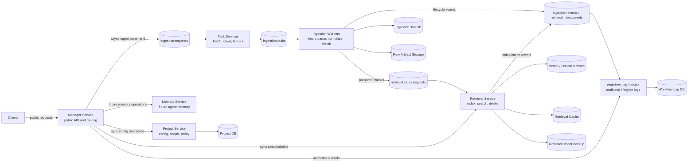
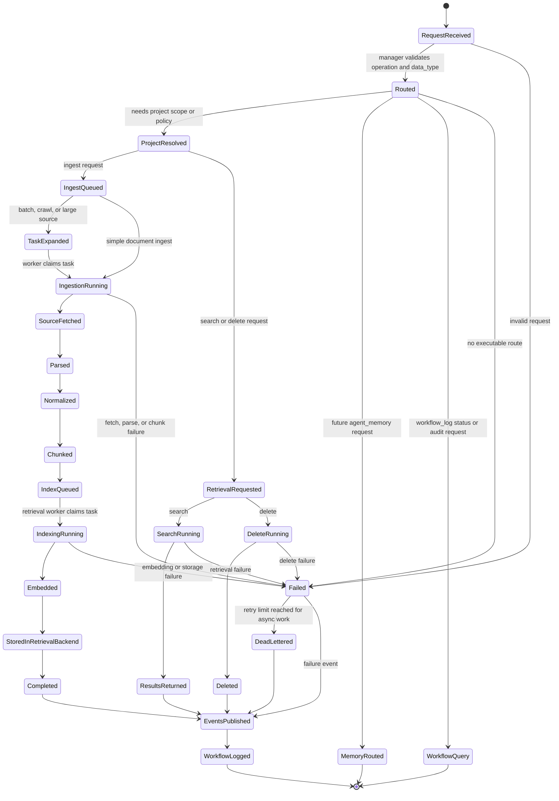

# Ideal System Boundary

This document defines the intended end-state shape of the project. It is not a
snapshot of the current implementation. It describes the target boundaries,
inputs, outputs, service ownership, and communication rules for a multi-service
information storing and retrieval system.

The system's main purpose is to accept information from multiple sources, route
that information through the correct ingestion workflow, normalize and index it,
store the durable results, and make the information searchable and retrievable
through stable APIs.

## Design Goals

- Keep every server independently deployable, testable, and replaceable.
- Keep public request routing centralized in the manager service.
- Keep service ownership narrow: each service owns one category of decisions and
  state.
- Use queues for long-running work so request handling remains asynchronous and
  resilient.
- Treat ingestion, indexing, storage, retrieval, and workflow logging as separate
  concerns.
- Preserve typed contracts between services so implementations can move from
  local clients to gRPC, HTTP, Kafka, Redpanda, or another broker without
  changing domain logic.

## Ideal Repository Shape

The ideal project layout is folder-oriented by service. Each service folder
contains the files needed to run that service, plus its local schemas, clients,
handlers, configuration loader, and tests.

```text
qdrant_rag_server/
  manager_service/
    server/
    routing/
    clients/
    schemas/
    config/

  project_service/
    server/
    adapters/
    config/
    schemas/

  ingestion_service/
    server/
    routing/
    handlers/
    source/
    normalization/
    chunking/
    jobs/
    storage/
    schemas/

  retrieval_service/
    server/
    retrieval/
    indexing/
    embedding/
    ranking/
    storage/
    llm/
    health/
    schemas/

  memory_service/
    server/
    schemas/
    storage/

  workflow_log_service/
    server/
    consumer/
    repository/
    schemas/

  shared/
    contracts/
    queue/
    errors/
    telemetry/

  configs/
    manager/
    project/
    ingestion/
    retrieval/
    memory/
    workflow_log/

  docs/
  tests/
  deployment/
  examples/
```

Service folders should not import another service's internals. Cross-service
access should happen through typed clients, queue messages, or transport DTOs
defined in the owning service or in `shared/contracts` when the contract is
truly service-neutral.

## Service Ownership

### Manager Service

The manager is the only public entry point for normal client traffic. It owns
request classification, authorization handoff, route selection, correlation ID
creation, and response aggregation.

Ideal responsibilities:

- Accept public API requests.
- Validate operation, `data_type`, tenant, project, user, and KB identifiers.
- Decide the target service for each operation.
- Convert public requests into internal service commands.
- Publish asynchronous commands to queues when work is long-running.
- Call synchronous service APIs only for short reads, status checks, health, and
  already-completed retrieval operations.
- Return stable request acknowledgements, job IDs, status responses, or retrieval
  results to clients.

The manager should not parse documents, call Qdrant directly, create embeddings,
perform chunking, or write service-owned databases.

### Project Service

The project service owns project-specific configuration and visibility rules.
It resolves how a request should behave inside a project, but it does not own
heavy ingestion or retrieval implementation details.

Ideal responsibilities:

- Store and resolve project, user, KB, and scope configuration.
- Own source adapter configuration for project-bound sources.
- Build project-aware filters and retrieval intent.
- Provide project metadata to ingestion and retrieval services.
- Enforce project-level visibility and policy decisions.

### Ingestion Service

The ingestion service owns the transformation from source input to normalized,
index-ready content. It may run multiple specialized ingestion workers behind a
common queue contract.

Ideal responsibilities:

- Consume ingestion commands from queues.
- Fetch source material from files, URLs, raw text, object storage, or external
  connectors.
- Detect file type, MIME type, source type, and handler capability.
- Route the source to the correct ingestion handler.
- Parse documents into structured text, tables, metadata, and attachments when
  supported.
- Clean and normalize content.
- Chunk content into retrieval-ready units.
- Persist ingestion job state.
- Publish lifecycle events.
- Forward prepared chunks to indexing through a retrieval indexing command or
  indexing queue.

The ingestion service should not own vector database search behavior, ranking,
generation, or project route decisions.

### Task Services

Task services are specialized workers that sit between the manager and concrete
ingestion handlers when a request needs additional routing or decomposition.
They exist to keep the manager simple and keep ingestion workers focused.

Example task service responsibilities:

- Split a batch ingest request into per-document ingest commands.
- Expand a website ingest request into page-level crawl tasks.
- Route large uploads to file-specific ingestion queues.
- Retry failed subtasks with bounded policies.
- Fan out work across specialized ingestion workers.
- Fan in partial results and publish a final task status.

Task services should communicate by queue. They should avoid direct calls to
parsers, vector stores, or public manager handlers.

### Retrieval Service

The retrieval service owns search, indexing into retrieval backends, embedding
integration, ranking, and retrieval-time storage access.

Ideal responsibilities:

- Consume prepared indexing commands from ingestion or task services.
- Generate dense embeddings and sparse representations.
- Enrich chunks with retrieval metadata.
- Upsert vectors and payloads into Qdrant or another retrieval backend.
- Maintain lexical, sparse, dense, and hybrid indexes.
- Execute search requests with filters, scoring, reranking, and cache lookup.
- Delete indexed documents and invalidate caches.
- Read raw document backups when retrieval responses need source material.
- Report retrieval health and index version status.

The retrieval service should not parse source documents or decide public request
routing.

### Database and Storage Services

Storage should be treated as a service boundary even when implemented by local
libraries. Durable persistence is owned by the service that understands the
state being stored.

Ideal storage ownership:

- Project service stores project configuration and visibility state.
- Ingestion service stores ingest jobs, source fetch metadata, and raw ingest
  artifacts when needed.
- Retrieval service stores vector payloads, indexes, retrieval caches, and raw
  document backups needed for retrieval.
- Workflow log service stores lifecycle events and audit records.
- Memory service stores agent memory records when that data type is enabled.

Database services should expose typed APIs or repository interfaces. Other
services should not reach into their tables or storage buckets directly.

### Workflow Log Service

The workflow log service owns lifecycle event consumption and audit history.

Ideal responsibilities:

- Consume service events from queue topics.
- Store durable workflow logs.
- Provide query APIs for task history, ingest history, and operational audit.
- Keep logging failure isolated from the success path of ingestion or retrieval.

### Memory Service

The memory service is reserved for long-lived agent memory and non-document
knowledge. It should be a separate service because memory records have different
lifecycles, permissions, ranking behavior, and deletion semantics from project
documents.

## Ideal Inputs

The system should accept typed public requests through the manager. Every input
must include enough routing metadata to identify the operation, data type, owner,
and desired behavior.

Common request envelope:

```json
{
  "operation": "ingest | search | delete | status",
  "data_type": "project_document | agent_memory | workflow_log",
  "project_id": "project identifier",
  "user_id": "user identifier",
  "kb_id": "knowledge-base identifier",
  "correlation_id": "optional caller-provided trace id",
  "payload": {}
}
```

Ingest payload examples:

```json
{
  "doc_id": "document identifier",
  "source_uri": "file, s3, http, or connector URI",
  "raw_text": "optional inline text",
  "raw_content": "optional encoded content",
  "metadata": {
    "filename": "example.pdf",
    "content_type": "application/pdf"
  },
  "policy": {
    "chunking": "section",
    "overwrite": true,
    "store_raw": true
  }
}
```

Search payload examples:

```json
{
  "query": "user search text",
  "filters": {
    "doc_id": "optional document filter",
    "tags": ["optional", "labels"]
  },
  "retrieval": {
    "mode": "dense | sparse | hybrid",
    "top_k": 10,
    "rerank": true
  }
}
```

Delete payload examples:

```json
{
  "doc_id": "document identifier",
  "delete_raw": true,
  "delete_indexes": true
}
```

Status payload examples:

```json
{
  "job_id": "ingestion or task job identifier"
}
```

## Ideal Outputs

Public responses should be stable even if internal transports change.

Async ingest acknowledgement:

```json
{
  "accepted": true,
  "job_id": "job identifier",
  "status": "pending",
  "correlation_id": "trace id"
}
```

Task or ingest status response:

```json
{
  "job_id": "job identifier",
  "status": "pending | running | completed | failed",
  "error": "nullable error message",
  "created_at": "timestamp",
  "updated_at": "timestamp"
}
```

Search response:

```json
{
  "query": "user search text",
  "results": [
    {
      "doc_id": "document identifier",
      "chunk_id": "chunk identifier",
      "score": 0.94,
      "text": "matched chunk text",
      "metadata": {}
    }
  ],
  "correlation_id": "trace id"
}
```

Delete response:

```json
{
  "deleted": true,
  "doc_id": "document identifier",
  "correlation_id": "trace id"
}
```

## Ideal Architecture

### System Architecture Graph



The graph shows the intended system boundary. Solid arrows represent ownership
or calls at the architecture level; queue nodes represent asynchronous handoff
points. The manager is the public coordinator, queues absorb variable-latency
work, and each service writes only to storage it owns.

### Transition Diagram



The transition diagram describes state movement, not a single process. Public
requests first pass through the manager. Long-running states move into queues
and workers. Terminal states publish lifecycle events so workflow logging can
record both successful and failed work.

```text
clients
  -> manager_service
       -> project_service                 synchronous config/scope reads
       -> ingestion task queue             async ingest commands
       -> retrieval_service                synchronous search/delete/status reads
       -> memory_service                   future memory operations
       -> workflow_log_service             status/audit reads

ingestion task queue
  -> task services
       -> specialized ingestion queues
            -> ingestion workers
                 -> raw storage service
                 -> ingestion job store
                 -> indexing queue
                 -> workflow event queue

indexing queue
  -> retrieval_service indexing workers
       -> embedding providers
       -> sparse encoders
       -> vector database service
       -> retrieval cache
       -> raw document backup storage

workflow event queue
  -> workflow_log_service
       -> workflow log database
```

The manager coordinates the request lifecycle, but it does not perform the work.
Long-running work moves through queues. Service workers claim tasks, update
durable status, publish events, and write to their owned stores.

## Communication Rules

### Synchronous Communication

Use synchronous calls for bounded, low-latency operations:

- manager to project service for project config, scope, and policy resolution
- manager to retrieval service for search
- manager to ingestion service for job status
- manager to workflow log service for audit queries
- manager to service health endpoints

Synchronous calls should have explicit timeouts, typed errors, and correlation
IDs. They should not hide long-running work.

### Asynchronous Communication

Use queues for work that can take variable time or needs backpressure:

- ingestion requests
- batch task expansion
- website crawl tasks
- file parsing tasks
- indexing requests
- lifecycle events
- cache invalidation events
- retry and dead-letter workflows

Queue messages should use a consistent envelope:

```json
{
  "topic": "ingestion.requests",
  "key": "project:user:document",
  "headers": {
    "correlation_id": "trace id",
    "project_id": "project identifier",
    "user_id": "user identifier"
  },
  "payload": {}
}
```

The ideal queue implementation should support:

- bounded worker concurrency
- durable messages in production
- at-least-once delivery
- idempotent consumers
- retries with maximum attempts
- dead-letter topics
- per-topic metrics
- correlation IDs across all messages
- backpressure when downstream services are unhealthy

## Core Topics

Recommended topic names:

| Topic | Producer | Consumer | Purpose |
| --- | --- | --- | --- |
| `ingestion.requests` | manager service | task service or ingestion service | Accept document ingestion commands. |
| `ingestion.tasks` | task service | ingestion workers | Fan out source-specific ingest work. |
| `ingestion.events` | ingestion service | workflow log service | Record ingest lifecycle changes. |
| `retrieval.index.requests` | ingestion service | retrieval indexing workers | Index prepared chunks. |
| `retrieval.index.events` | retrieval service | workflow log or manager | Report indexing progress. |
| `retrieval.cache.events` | retrieval service or manager | retrieval cache workers | Invalidate or refresh retrieval caches. |
| `dead_letter` | queue broker | operators or repair workers | Store exhausted failed messages. |

## Main Data Flow

### Ingestion Flow

1. Client sends an ingest request to the manager.
2. Manager validates the request and resolves project policy from the project
   service.
3. Manager creates a correlation ID and job ID.
4. Manager publishes an ingest command to `ingestion.requests`.
5. Manager returns an accepted response with the job ID.
6. A task service optionally decomposes the request into source-specific tasks.
7. Ingestion workers fetch, parse, normalize, and chunk content.
8. Ingestion service stores job state and raw artifacts as needed.
9. Ingestion service publishes prepared chunks to `retrieval.index.requests`.
10. Retrieval indexing workers embed and upsert chunks into the retrieval store.
11. Retrieval service writes index status and invalidates affected caches.
12. Ingestion and retrieval services publish lifecycle events.
13. Workflow log service consumes events and stores audit records.

### Retrieval Flow

1. Client sends a search request to the manager.
2. Manager validates the request and resolves project scope.
3. Manager forwards the search command to the retrieval service.
4. Retrieval service checks cache when enabled.
5. Retrieval service embeds the query and executes dense, sparse, or hybrid
   search.
6. Retrieval service applies filters, ranking, and optional reranking.
7. Retrieval service returns normalized results to the manager.
8. Manager returns public search results to the client.

### Delete Flow

1. Client sends a delete request to the manager.
2. Manager validates authorization and resolves project scope.
3. Manager sends the delete command to the retrieval service.
4. Retrieval service deletes vector payloads, lexical records, cache entries,
   and raw backups according to policy.
5. Retrieval service publishes lifecycle or cache events.
6. Manager returns the delete result.

## Boundary Stakes

These are the architectural stakes that should remain stable as the project
evolves.

### The Manager Is a Router, Not a Worker

The manager should make routing decisions and coordinate responses. If it starts
parsing documents, embedding text, or writing retrieval storage directly, service
boundaries have collapsed.

### Queues Are the Async Backbone

Ingestion and indexing are naturally variable-latency workflows. They should be
queue-backed so the system can absorb bursts, retry failures, and scale workers
without changing public APIs.

### Services Own Their State

Each service owns the database tables, object storage prefixes, indexes, and
caches required for its domain. Other services access that state only through
typed APIs or queue contracts.

### Contracts Must Be Transport-Neutral

The system may start with local clients and SQLite queues, then move to gRPC,
HTTP, Kafka, Redpanda, Postgres, or cloud storage. Domain contracts should not
depend on one transport implementation.

### Consumers Must Be Idempotent

Production queues should assume at-least-once delivery. Ingestion, indexing,
delete, and event consumers must tolerate duplicate messages by using stable job
IDs, document IDs, content hashes, and idempotency keys.

### Failures Should Be Isolated

Logging failures should not fail completed indexing. Raw backup cleanup failures
should not hide successful vector deletion. Cache invalidation failures should
be visible and retryable without corrupting primary state.

### Observability Is Part of the Boundary

Every request and queue message should carry a correlation ID. Services should
emit structured logs, metrics, health checks, and lifecycle events so operators
can trace a document from request acceptance through ingestion, indexing, and
retrieval.

## Readiness Criteria

The ideal architecture is reached when:

- Each service can run independently with its own server entry point.
- The manager can route all public operations without importing service
  internals.
- Ingestion and indexing work through durable queues.
- Job status survives process restarts.
- Retrieval search and delete work through retrieval-service APIs only.
- Workflow events are consumed by a separate workflow log service.
- Service contracts are documented and covered by tests.
- Local development can run the full stack with replaceable local backends.
- Production deployment can replace local queues and stores without changing
  service business logic.
