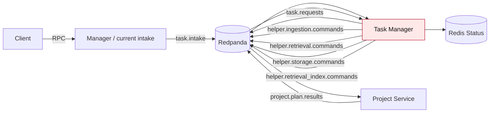
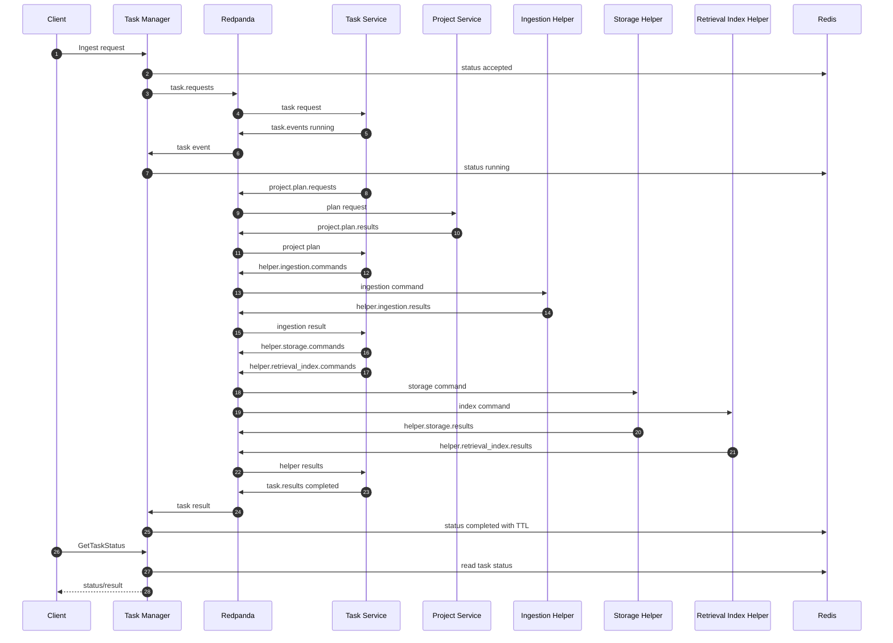
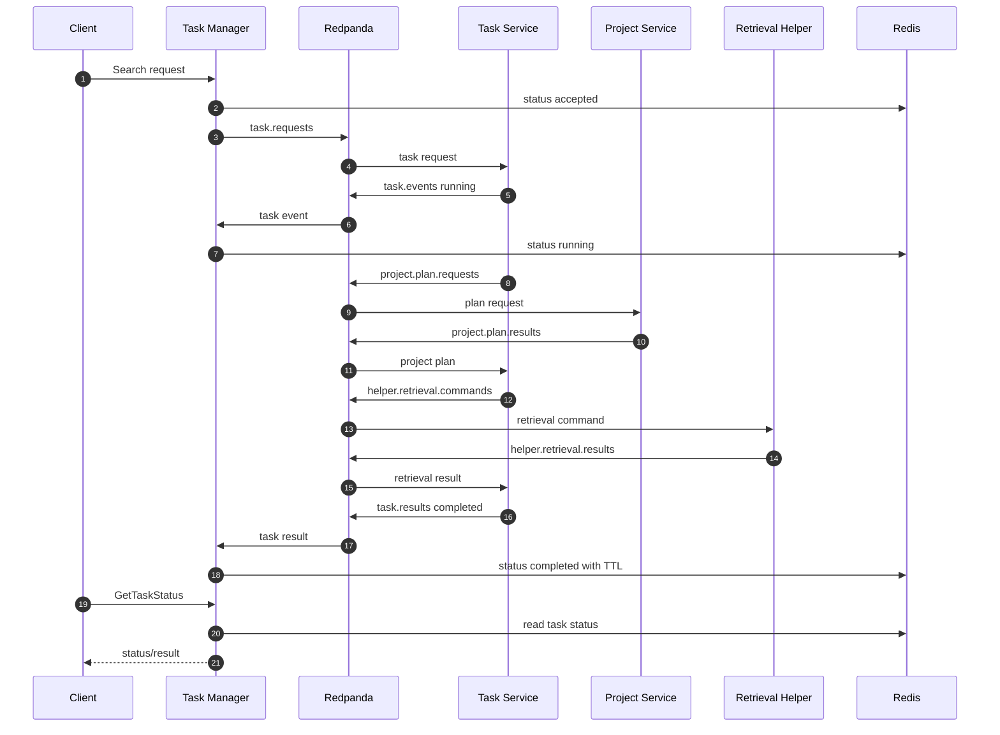

# Responsibility Shift Implementation Plan

Status: implementation plan.

This file only covers the responsibility shift:

```text
task manager = task intake + status read model
task service = task execution + workflow orchestration
project service = project setup/planning
helpers = narrow capability workers
```

## Target Responsibilities

| Component | Owns | Must Not Own |
| --- | --- | --- |
| Task manager | Client task intake, task ID creation, task request publication, status event consumption, Redis/status read model, status API | Project planning, helper command creation, helper fan-in, retries, dead letters, execution state |
| Task service | Task execution, project planning requests, helper fan-out/fan-in, retries, dead letters, durable execution state, final results | Public client API, auth, Redis status read API |
| Project service | Project setup, collection name, retrieval config, chunker config, scope/filter, placement plan | Task execution, helper orchestration |
| Ingestion helper | Source loading, parsing, cleaning, chunking, ingestion-owned job metadata | Project policy, task lifecycle |
| Retrieval helper | Search/delete execution | Project policy, task lifecycle |
| Retrieval-index helper | Chunk indexing | Project policy, task lifecycle |
| Storage helper | Raw content put/get/delete | Project policy, task lifecycle |
| Workflow log | Async audit/event observation | Main request path |

## Target Topics

| Topic | Sender | Receiver | Purpose |
| --- | --- | --- | --- |
| `task.requests` | Task manager | Task service | Normalized accepted task request |
| `task.events` | Task service | Task manager | Non-terminal task progress/status updates |
| `task.results` | Task service | Task manager | Terminal task result |
| `project.plan.requests` | Task service | Project service | Ask for project setup/planning |
| `project.plan.results` | Project service | Task service | Return project-aware execution plan |
| `helper.ingestion.commands` | Task service | Ingestion helper | Prepare/chunk source content |
| `helper.ingestion.results` | Ingestion helper | Task service | Prepared content result |
| `helper.storage.commands` | Task service | Storage helper | Store/delete raw content |
| `helper.storage.results` | Storage helper | Task service | Storage result |
| `helper.retrieval.commands` | Task service | Retrieval helper | Search/delete retrieval data |
| `helper.retrieval.results` | Retrieval helper | Task service | Retrieval result |
| `helper.retrieval_index.commands` | Task service | Retrieval-index helper | Index prepared chunks |
| `helper.retrieval_index.results` | Retrieval-index helper | Task service | Index result |
| `audit.events` | Any service | Workflow log | Observational audit events |

The manager-to-task-manager `task.intake` topic remains the public intake
handoff. Project planning uses only `project.plan.requests` and
`project.plan.results`; the old `domain.project.*` project-planning topics are
not a runtime compatibility path.

## Implementation Steps

### 1. Add Shared Task Boundary Contracts

Create shared transport-neutral contracts for the new task-manager/task-service
boundary.

Add:

- `TaskRequestPayload`
- `TaskEventPayload`
- `TaskExecutionResultPayload`
- `ProjectPlanRequestPayload`
- `ProjectPlanResultPayload`

Acceptance:

- task manager can publish `task.requests` without helper details
- task service can publish `task.events` and `task.results` without importing
  task-manager code
- project service can return JSON-safe plans without leaking project internals

### 2. Create `task_service`

Add a new top-level `task_service/` package.

Required files:

- `task_service/__init__.py`
- `task_service/config.py`
- `task_service/app.py`
- `task_service/worker.py`
- `task_service/dispatcher.py`
- `task_service/repository.py`
- `tests/task_service/`

Acceptance:

- task service starts as an independent process
- task service consumes `task.requests`
- task service publishes `task.events` and `task.results`
- task service has import-boundary tests

### 3. Move Workflow Execution Out Of Task Manager

Move these responsibilities from `task_manager_service` to `task_service`:

- project planning request/result handling
- helper command creation
- helper result fan-in
- ingestion follow-up scheduling for storage and retrieval indexing
- delete fan-out to retrieval and storage
- retry handling
- dead-letter publication
- final result idempotency

Acceptance:

- normal helper command sender is `task_service`
- task manager code no longer references helper command topics
- task-service tests cover ingest, search, delete, retry, and dead-letter paths

### 4. Move Durable Execution State To Task Service

Move task execution state out of task manager.

Legacy state table:

- `task_states`

Current owner:

- `task_service`

Implemented state tables:

- `task_executions`
- `task_steps`
- `task_step_attempts`
- `task_results`

Acceptance:

- task service can restart without losing expected helpers, completed helpers,
  failed helpers, retry plans, helper attempt history, or final result idempotency
- task manager restart does not affect in-flight execution
- legacy `task_states` rows migrate into explicit execution/step/attempt/result tables

### 5. Reduce Task Manager To Intake And Status

Change task manager to only:

- receive raw client task requests
- validate transport-level fields
- normalize requests into `TaskRequestPayload`
- create `task_id` and `correlation_id`
- write initial status: `accepted` or `queued`
- publish `task.requests`
- consume `task.events` and `task.results`
- update Redis/status read model
- serve status reads

Acceptance:

- task manager does not publish `project.plan.*`
- task manager does not publish `helper.*`
- task manager does not own task fan-in state
- task manager can be tested without ingestion, retrieval, storage, or indexing
  helpers

### 6. Convert Project Domain To Project Planning

Reframe the project-service broker boundary as planning.

Removed old aliases:

```text
domain.project.commands -> project.plan.requests
domain.project.results  -> project.plan.results
```

The plan result must include:

- operation
- project ID
- user ID
- collection name
- retrieval config
- chunker config
- retrieval filter/scope
- placement plan
- source metadata needed by the task service

Acceptance:

- project service returns JSON-safe shared contract payloads
- project service does not send helper commands
- task service can build helper commands from task request + project plan

### 7. Keep Helpers Narrow

Helpers should only execute their own command contracts.

Acceptance:

- ingestion helper returns prepared content/chunk metadata
- storage helper returns raw storage result
- retrieval helper returns search/delete result
- retrieval-index helper returns index result
- helpers do not import task manager, task service, or project internals

### 8. Update Local Runtime

Update local broker-first runtime to start:

- task manager / intake + status process
- task service / executor process
- project service / planning process
- helper processes
- Redis status store
- Redpanda

Acceptance:

- local startup validates both task manager and task service readiness
- `test_2` ingest flow runs through `task.requests -> task_service -> helpers`
- `test_3` search flow runs through `task.requests -> task_service -> helpers`

### 9. Update Tests

Required test coverage:

- task manager publishes only `task.requests`
- task manager writes initial Redis status
- task manager updates Redis from `task.events` and `task.results`
- task service consumes `task.requests`
- task service requests project plans
- task service publishes helper commands
- task service aggregates helper results
- task service publishes final `task.results`
- project planning payloads are JSON-safe
- helper command sender is task service

Acceptance:

- tests assert sender and receiver ownership for each topic
- old task-manager orchestration tests are moved or rewritten under
  `tests/task_service/`

### 10. Remove Compatibility Orchestration

After the new path is passing:

- remove task-manager helper dispatch from normal runtime
- remove task-manager durable fan-in state
- keep topic aliases only if external compatibility still requires them

Acceptance:

- normal runtime follows:

```text
client -> task manager -> task.requests -> task service -> project planning -> helpers -> task.results -> task manager status
```

## Graphs

### Current Problem



### Target Ownership

```mermaid
flowchart LR
    C[Client] -->|RPC| TM[Task Manager / Intake + Status]
    TM -->|task.requests| B[(Redpanda)]
    B -->|task.requests| TS[Task Service / Executor]

    TS -->|project.plan.requests| B
    B --> P[Project Service / Planning]
    P -->|project.plan.results| B
    B --> TS

    TS -->|helper commands| B
    B --> I[Ingestion Helper]
    B --> R[Retrieval Helper]
    B --> RI[Retrieval Index Helper]
    B --> S[Storage Helper]
    B --> DB[SQLite / DB Helper]

    I -->|helper result| B
    R -->|helper result| B
    RI -->|helper result| B
    S -->|helper result| B
    DB -->|helper result| B
    B --> TS

    TS -->|task.events / task.results| B
    B --> TM
    TM --> Redis[(Redis Status Read Model)]
    TM -->|status RPC| C

    B -. audit.events .-> W[Workflow Log]
```

### Ingest Flow



### Search Flow


