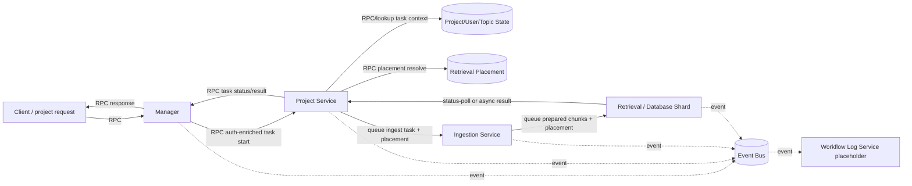
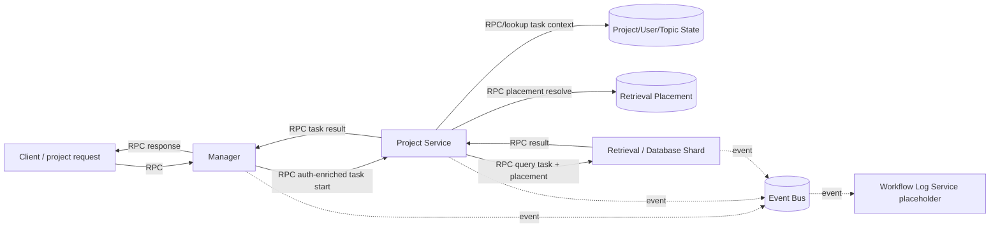

# Ideal Service Interaction Migration Plan

Status: draft migration plan.

This plan compares the current wiring with the ideal service model and defines
how to migrate while keeping the existing rules:

- all config code, env examples, and secrets stay under `./configs`
- service work stays async by default
- long-running work uses queues or other message passing
- message contracts remain typed and transport-neutral
- services do not import another service's internals
- workflow logging is observational only

## What Is Wrong Today

The current repository is a useful migration scaffold, but control flow is
still mixed:

- `manager_service` still routes directly to ingestion and retrieval clients.
- `project_service` still contains compatibility `RagEngine` execution logic.
- `ingestion_service` still delegates back to a project-document client in some
  paths.
- `retrieval_service` owns many capability concerns at once: retrieval, index
  writes, caches, raw storage, embeddings, ranking.
- `workflow_log_service` exists as an event sink, but it should not appear in
  the business path graph.

## Ideal Responsibility Model

The ideal design is:

```text
Manager = auth gate + context forwarder + task starter/status checker
Project service = project task executor / orchestrator + task-context owner
Ingestion service = generic async content preparation
Retrieval/database service = placement-aware storage/index/query capability
Workflow log = async observer only
```

The manager authenticates the client, resolves request/customer context from
the auth layer, starts tasks, checks task status, and returns responses to the
client. It may forward opaque customer and database-placement marks retrieved
from auth or routing metadata, but it does not own parsing, indexing,
retrieval, database assignment, or storage policy.

The project service owns task-related policy and orchestration for
project-document work. It retrieves project/user/topic task context, applies
visibility and business rules, and decides how to use ingestion and
retrieval/database capabilities.

Retrieval/database placement owns database assignment. It maps project, user,
topic, and document/bucket routing keys to retrieval shards. Database-side
caches stay shard-local, so requests should be routed to the shard that owns
the relevant placement rather than round-robin across all database servers.

Memory service is not part of the current design. It stays out of the core
graphs until a dedicated design section is added.

## Message Types

Use the messaging method on every edge:

- `RPC` for synchronous calls
- `queue` for async task handoff
- `status-poll` for task completion checks
- `event` for observational logging

The method must be explicit in every graph.

## Target Graphs

### Project Document Insertion



### Project Document Query



### Workflow Log


Workflow log is a read-side service for audit/history queries and an async sink
for events. It is not a required hop in the main business path.

## Compare Current Vs Ideal

| Area | Current | Ideal |
| --- | --- | --- |
| Manager | Routes directly to ingestion/retrieval clients in fallback paths. | Authenticates, forwards enriched context, starts project tasks, checks status, and returns results. |
| Project service | Owns config/scope and still contains compatibility execution. | Owns project task orchestration, task-context retrieval, visibility, and policy. |
| Ingestion service | Prepares content but still calls back into project-document compatibility paths. | Generic async task worker for source loading, parsing, cleaning, chunking. |
| Retrieval/database | Owns retrieval, indexing, embeddings, cache, raw storage. | Placement-aware capability service behind typed async/sync APIs, with shard-local cache. |
| Workflow log | Event sink exists but should stay out of business graphs. | Async observer only. |
| Memory service | Placeholder only. | Out of scope for this migration. |
| Config | Recently moved toward profile variants under `configs`. | All configs/env examples/keys stay under `configs`. |
| Async | Ingestion and indexing use queues locally. | Long-running tasks use durable queues with correlation IDs, retries, leases, and dead letters. |

## Required Flow Rules

### Manager

- authenticates public requests
- retrieves or receives customer context and opaque routing/placement marks from auth
- starts project tasks
- tracks task IDs
- checks task status
- returns task acknowledgements and final responses
- never does parsing, chunking, embedding, database assignment, or storage writes

### Project Service

- retrieves task-related project, user, and topic context
- decides policy and ownership
- resolves or requests retrieval/database placement for the task
- submits ingestion and retrieval/database work
- polls or receives status
- shapes results for the manager
- does not own raw parsing or vector storage internals

### Ingestion Service

- fetches source data
- detects format and parses content
- normalizes and chunks
- publishes prepared work or result messages
- persists only ingestion-owned job state

### Retrieval / Database Service

- resolves routing keys to database shard placements, or accepts a placement plan
- indexes prepared chunks
- queries retrieval backends
- manages shard-local caches and raw backups
- exposes basic store/retrieve/delete capabilities
- stays generic and reusable

### Retrieval Placement

- uses project, user, topic, and document/bucket routing keys
- assigns new routing keys to retrieval shards with weighted rendezvous
  hashing, a consistent-hashing variant that ranks every active shard by
  `hash(routing_key, shard_id) * effective_weight`
- stores the selected shard in a placement record; normal requests reuse the
  stored placement instead of recomputing against live load
- keeps placement records versioned so cache and routing can be invalidated on
  rebalance
- supports fanout plans when a hot project/user/topic is split into buckets
- chooses replicas by taking the next-highest rendezvous scores when
  replication is enabled
- rebalances explicitly by marking old placements moving/stale, creating a new
  placement version, reindexing or migrating data, and letting cache keys
  invalidate through `placement_version`
- does not depend on manager request handling

### Workflow Log Service

- consumes events asynchronously
- stores lifecycle/audit records
- is not on the main task path

## Migration Phases

### Phase 1: Align Documentation

Goal: make the graphs and docs match the intended design.

Tasks:

- keep workflow log out of the main business path diagrams
- show manager as task starter and status checker
- show message type labels on arrows
- document that memory is a placeholder/out-of-scope until a dedicated design
  section exists

### Phase 2: Make Manager A Project Task Coordinator

Goal: move manager toward task orchestration only.

Tasks:

- add explicit project task start and task status commands
- keep sync response handling in manager
- push long-running work to queue or async domain APIs

Acceptance:

- manager no longer routes directly to retrieval or ingestion for normal
  project-document operations
- manager talks to project service task APIs

### Phase 3: Extract Project Service Task Execution

Goal: make `project_service` the executor for project-document tasks.

Tasks:

- move project-document orchestration into project service
- have project service call ingestion and retrieval/database capabilities
- keep project policy and scope in project service

Acceptance:

- project service owns project-document task execution
- project service is the only manager-facing executor for project documents

### Phase 4: Make Ingestion Generic

Goal: remove compatibility callbacks from ingestion.

Tasks:

- ingestion accepts generic source/task payloads
- ingestion emits prepared-content messages or task status messages
- ingestion stops calling project-document compatibility clients

Acceptance:

- ingestion is reusable by project service and any future domain service

### Phase 5: Clarify Retrieval / Database Capabilities

Goal: keep retrieval/database basic and generic.

Current progress: placement core exists under `retrieval_service.placement`.
It provides models, routing-key generation, weighted rendezvous assignment,
replica selection, in-memory/SQLite registries, and a resolver that reuses
stored active placements. Placement plans are carried through retrieval
index/search/delete contracts and are now produced by project planning from
local placement config. Split ingestion forwards placement plans to retrieval
indexing. Retrieval indexing now writes primary plus replica placement targets.
Retrieval search resolves live shard stores, fans out by routing key, falls back
from primary to replica targets, merges hits by score, and namespaces cache keys
by placement scope. Retrieval delete removes dense and sparse records from the
placement write set. Per-project/default routing-policy persistence and
explicit moving/stale/active rebalance states are implemented locally.
Migration/reindex orchestration and production broker behavior are still
pending.

Tasks:

- keep retrieval/query/index/delete behind typed APIs
- keep Qdrant/cache/raw storage as implementation details of the capability
  service
- add database placement contracts for routing keys, placement plans, shard
  targets, and placement versions
- add retrieval shard registry and placement registry
- implement weighted rendezvous assignment for new routing keys and replica
  selection
- persist placement decisions so cache affinity is stable across requests
- keep cache affinity by routing reads/writes to the responsible shard
- avoid making a separate generic database service unless a true cross-domain
  need appears

Acceptance:

- project service calls retrieval/database capabilities through contracts, not
  internals
- normal retrieval/index/delete requests carry enough placement context to
  reach the owning database shard

### Phase 6: Reserve Future Domain Services

Goal: keep placeholders out of the project-document design.

Tasks:

- do not implement agent memory in this migration
- keep placeholder docs minimal if a future section is needed
- do not add workflow-log business routing unless separately scoped

Acceptance:

- project-document graphs do not include agent memory
- placeholder services do not affect project-document behavior

### Phase 7: Keep Workflow Log Observational

Goal: preserve audit/event logging without coupling it to request paths.

Tasks:

- standardize event envelopes
- emit events from manager, project, ingestion, and retrieval
- keep workflow log read-only from the manager

Acceptance:

- workflow log is only async/event-driven, never a required hop in the core
  business path

### Phase 8: Add Production Broker Semantics

Goal: replace local-only queue behavior with durable async semantics.

Tasks:

- add a production broker adapter behind `shared.queue.QueueBroker`
- add message metadata:
  - idempotency key
  - correlation ID
  - causation ID
  - attempt count
  - first-seen timestamp
  - visibility lease or claim timeout
  - last error
- add retry topics and dead-letter topics
- keep `LocalQueueBroker` and `SQLiteQueueBroker` for local development and
  tests

Acceptance:

- ingestion/indexing survive process restarts and worker failures
- failed messages can be retried and dead-lettered with repair context

### Phase 9: Remove Compatibility RagEngine Path

Goal: finish the migration.

Tasks:

- stop manager from adapting `ProjectDocumentClient` for normal routes
- move or delete compatibility `RagEngine` responsibilities after project,
  ingestion, and retrieval services own their final paths
- keep external compatibility gRPC API only as a thin adapter over manager or
  project domain APIs if still needed
- remove duplicate schemas and import shims

Acceptance:

- normal ingest/search/delete/status no longer depends on
  `project_service.rag.RagEngine`
- project service owns project policy and orchestration only
- ingestion and retrieval services are independently deployable
- full local runner and full test suite pass

## Non-Negotiable Rules

- configs stay under `./configs`
- env files stay under `./configs`
- message passing must stay explicit
- no service should import another service's private internals
- manager should orchestrate tasks and status, not execute business logic
- workflow log is a side channel only

## Recommended Next Section

```text
Project Config/Scope API Extraction
```

This is the first step that makes `project_service` a true task executor
instead of a compatibility wrapper.
