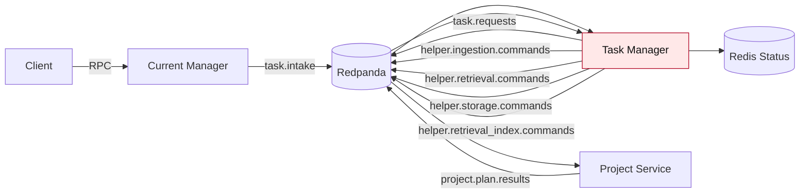
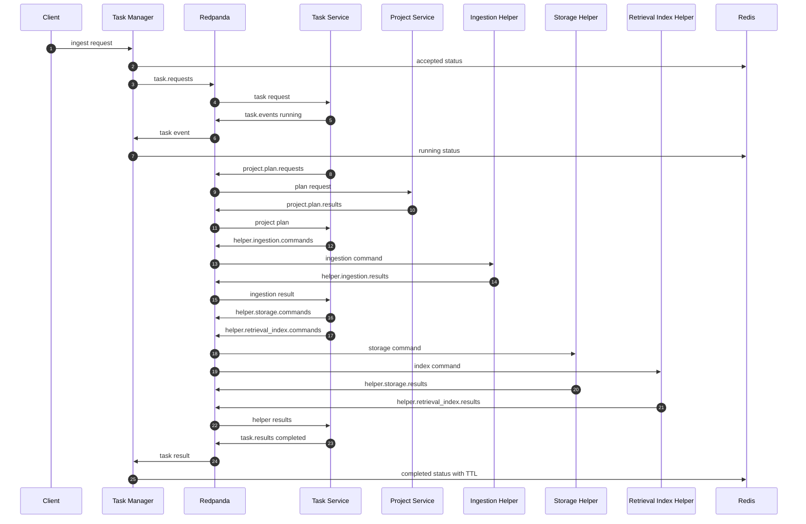
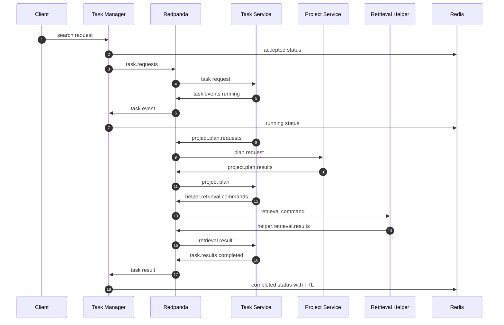

# Responsibility Shift Progress

Reviewed: 2026-07-21

This file only tracks the implementation of the responsibility shift:

```text
task manager = intake + status read model
task service = execution + orchestration
project service = project setup/planning
helpers = narrow capability workers
```

## Overall Progress

| Area | Progress | Completed | Missing |
| --- | ---: | --- | --- |
| Responsibility boundary | 87% | Manager, task manager, task service, project planning, and helper ownership are split in code; generated gRPC stubs moved to `shared.transport.grpc.generated`; project service no longer imports retrieval internals; retrieval ingest compatibility pipeline and project schema aliases were removed; workflow-log now consumes passive `audit.events` separately from command/reply flow. | Keep tightening import-boundary coverage as service-owned modules evolve. |
| Task manager intake/status | 90% | Task manager consumes intake, publishes only `task.requests`, consumes `task.events`/`task.results`, and writes Redis status through the shared status store contract. The local end-to-end smoke verifies accepted-to-completed status through the manager gRPC API. | Add longer-running recovery and failure-transition coverage. |
| Task service executor | 88% | `task_service` owns project plan dispatch, helper fan-out/fan-in, immediate or scheduled retries, dead letters, final result publication, helper attempt propagation, SQLite execution state, and DB-backed recovery for due retries and expired helper leases. | Add broader crash-recovery and publish/DB failure-mode coverage. |
| Project planning boundary | 85% | Project planning uses canonical `project.plan.requests/results`; old `domain.project.*` runtime aliases were removed from shared topics, config, task-service consumers, and tests; placement scope is project-owned and serialized through plan payloads. | Keep plan payloads JSON-safe as new project capabilities are added. |
| Helper ownership | 84% | Ingestion, retrieval, retrieval-index, storage, and SQLite node worker/helper paths exist; helper workers consume their command topics and return helper results with attempts; import-boundary tests keep helpers from depending on task manager, task service, or project internals. | Keep import-boundary tests strict as helper command contracts evolve. |
| Execution state ownership | 92% | SQLite task-service state repository persists execution metadata, helper expectations, helper results, retry plans, attempt history, lease/schedule fields, and final publication markers in `task_executions`, `task_steps`, `task_step_attempts`, and `task_results`; legacy `task_states` rows migrate at repository startup; the recovery loop claims expired leases and due retries. | Add broader restart/crash integration coverage and transactional outbox/inbox only if stronger publish/DB atomicity is required. |
| Status read model | 90% | Redis `TaskStatusRecord`, TTL writes, and status reads exist; task manager updates status from task events/results, and manager/task-manager composition now loads the same Redis namespace from environment settings. | Add broader failure and expiry transition coverage. |
| Local runtime | 98% | Local broker-first runner starts manager, task manager, task service, project service, helper workers, Redis, a Kafka-compatible broker, Qdrant, storage, SQLite node, and workflow log. Local topics and Redis keys are namespaced, startup waits for broker metadata and manager gRPC readiness, partial failures are cleaned up, workflow-log observes `audit.events`, task-service retry/dead-letter/recovery settings are explicit, deterministic smoke embeddings avoid model-download dependency and stale collection dimensions, `--smoke` passed health, ingest/status, and strict search through Docker-backed Redpanda/Redis/Qdrant, and GitHub Actions has manual Docker-backed live-infra/full-smoke jobs. | Exercise the managed Docker smoke job in CI and add optional uncached sentence-transformers startup evidence. |
| Tests | 92% | Full pytest suite passes; focused tests assert task-manager intake/status-only behavior, task-service helper orchestration/recovery/idempotency, project planning topics, service import boundaries, broker-first integration flow, broker topic propagation, local runner defaults, live Redpanda/Redis smoke, full local smoke, asynchronous status polling, deterministic embedding behavior, retrieval-index failure propagation, and service consumer commit-after-success boundaries. The opt-in live Redpanda/Redis integration gate passed locally with Docker-backed infra. | Continue moving broad legacy tests under owning service folders and execute the managed Docker runtime job remotely. |

## Steps

| Step | Topic | Implementation | Acceptance Standard | Status |
| ---: | --- | --- | --- | --- |
| 1 | Replace planning docs | Replace original broad `plan.md` and `progress.md` with responsibility-shift-only implementation docs. | Both docs focus only on task manager, task service, project planning, helper ownership, status, and graphs. | Complete |
| 2 | Add task boundary topics | Add canonical topics for `task.requests`, `task.events`, `project.plan.requests`, and `project.plan.results`; remove obsolete `domain.project.*` runtime topics. | Topic constants exist and broker bootstrap creates only canonical project-planning topics. | Complete |
| 3 | Add task boundary contracts | Add typed shared contracts for task requests, task events, task results, project plan requests, and project plan results. | Contracts are transport-neutral, validated, and covered by unit tests. | Complete |
| 4 | Create task service package | Add `task_service/` package, settings, app context, worker, repository, dispatcher, and tests. | Task service starts independently and consumes `task.requests`. | Complete |
| 5 | Move orchestration code | Move project-plan dispatch, helper fan-out/fan-in, follow-up scheduling, retries, dead letters, and final result publication out of `task_manager_service`. | Helper commands are published by task service in normal runtime. | Complete |
| 6 | Move execution state | Move `task_states` repository ownership to task service and split durable state into execution, step, and result tables. | Task service restart preserves in-flight execution state; task manager restart does not affect execution. | Complete |
| 7 | Reduce task manager code | Strip task manager normal path down to raw task intake, request normalization, `task.requests` publication, status event/result consumption, Redis updates, and status reads. | Task manager normal code has no helper command topic references. | Complete |
| 8 | Recontract project planning | Use only `project.plan.requests/results` for project planning; remove `domain.project.commands/results` runtime aliases. | Project service returns JSON-safe project plans; it does not publish helper commands. | Complete |
| 9 | Keep helpers narrow | Validate ingestion, retrieval, retrieval-index, storage, and SQLite/database helpers only consume their helper commands and return helper results. | Helpers do not import task manager, task service, or project internals. | Complete |
| 10 | Update Redis status flow | Update task manager to consume `task.events` and `task.results` and upsert Redis task status. | Redis status reflects accepted/running/failed/completed states from task-service messages. | Complete |
| 11 | Update local runtime | Start task manager/intake and task service/executor separately in broker-first local runtime. | Local startup validates both processes and runs ingest/search through the new split. | Complete |
| 12 | Rewrite tests | Move old task-manager orchestration tests under task-service coverage and add task-manager intake/status-only tests. | Tests assert sender/receiver ownership for every topic. | Complete |
| 13 | Remove compatibility orchestration | Remove old task-manager helper dispatch after task-service path passes. | `task_manager_service` cannot create ingestion/retrieval/storage/index helper commands in normal runtime. | Complete |

## Graphs

### Current State To Replace



### Target Structure

```mermaid
flowchart LR
    C[Client] -->|RPC| TM[Task Manager / Intake + Status]
    TM -->|task.requests| B[(Redpanda)]
    B --> TS[Task Service / Executor]

    TS -->|project.plan.requests| B
    B --> P[Project Service / Planning]
    P -->|project.plan.results| B
    B --> TS

    TS -->|helper commands| B
    B --> I[Ingestion Helper]
    B --> R[Retrieval Helper]
    B --> RI[Retrieval Index Helper]
    B --> S[Storage Helper]
    B --> DB[SQLite / DB Helper]

    I -->|helper result| B
    R -->|helper result| B
    RI -->|helper result| B
    S -->|helper result| B
    DB -->|helper result| B
    B --> TS

    TS -->|task.events / task.results| B
    B --> TM
    TM --> Redis[(Redis Status Read Model)]
    TM -->|status RPC| C

    B -. audit.events .-> W[Workflow Log]
```

### Target Ingest Sender Receiver Flow



### Target Search Sender Receiver Flow


