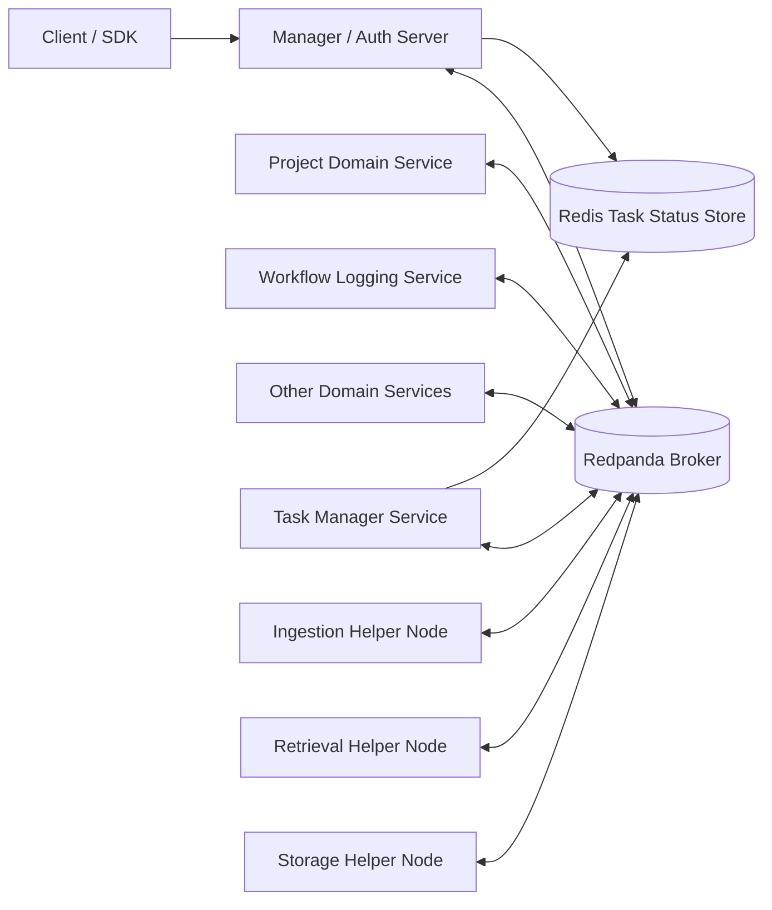
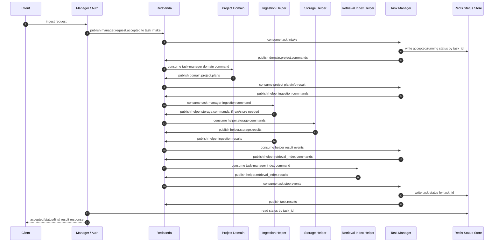
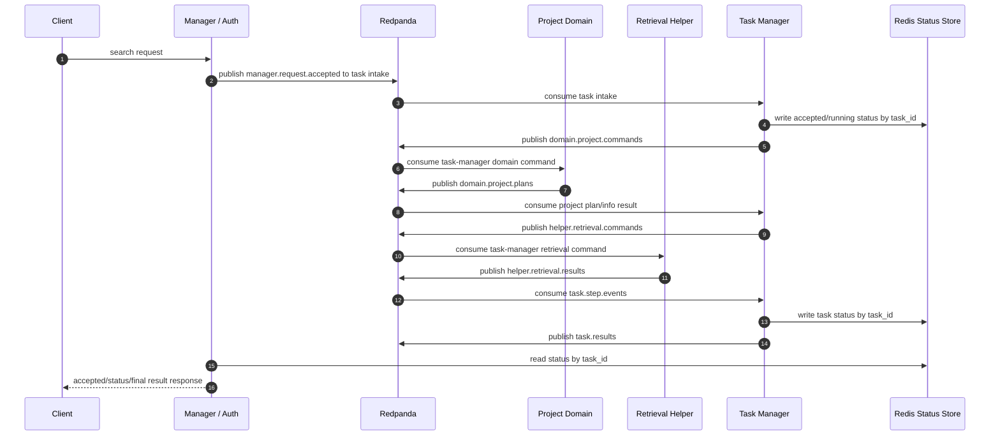
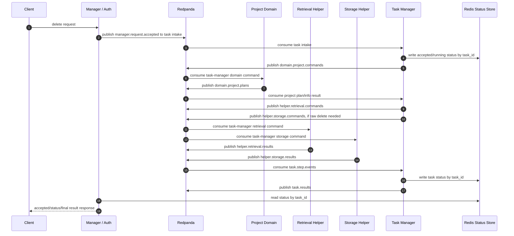
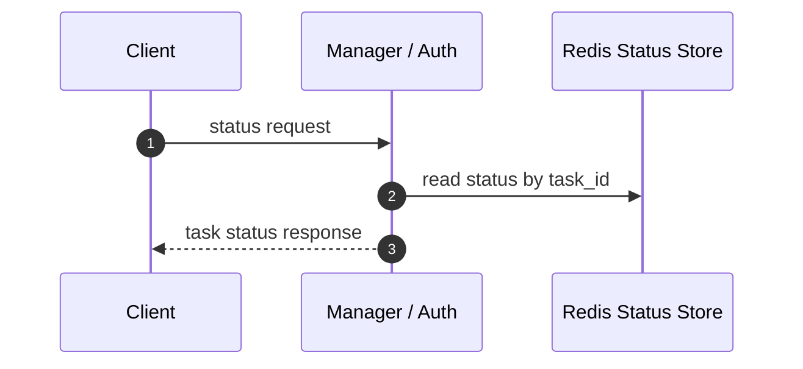
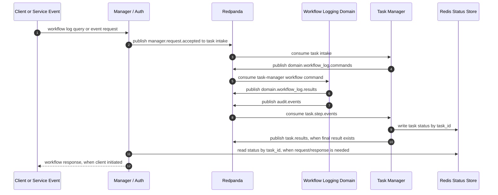
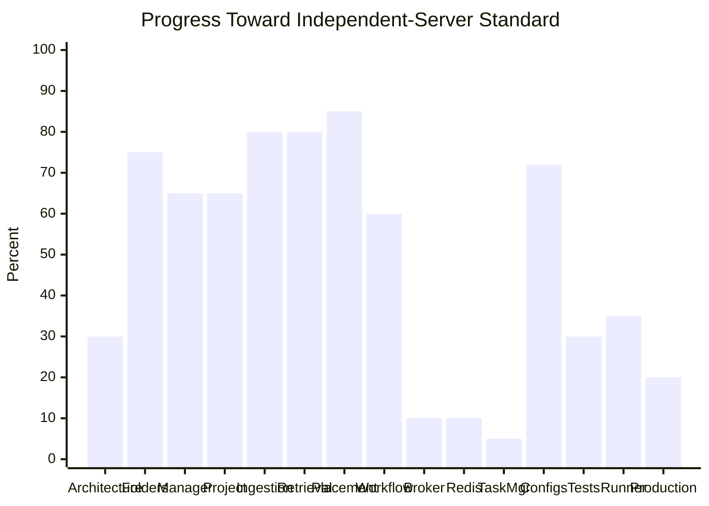
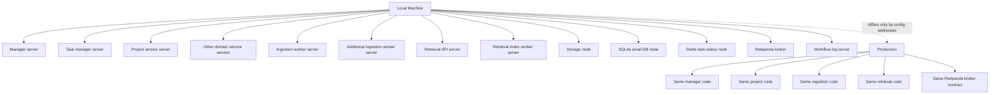

# Development Progress

**Reviewed**: 2026-06-23
**Status**: architecture target corrected. Service features are mostly
implemented locally, but the repository does not yet satisfy the broker-first
independent-server topology in `structure.md`.

## Overall Progress

| Area | Progress | Completed? | Current state | Missing / How to improve |
| --- | ---: | --- | --- | --- |
| Architecture standard | 32% | No | The target is now broker-first with task-manager dispatch: manager/auth -> broker intake -> task manager -> broker -> domain service -> broker -> task manager -> broker -> helper nodes -> broker -> task manager. Earlier manager-direct-service and manager-direct-domain-trigger docs were wrong. | Redesign runtime routing so manager only accepts public requests, task manager triggers domain task servers, and every worker/server communicates through Redpanda. |
| Independent service folders | 75% | Partial | Top-level service folders exist. Broker, Redis, and SQLite config folders plus service test folders now exist as tracked layout placeholders. | Move actual tests into service folders and split remaining mixed compatibility/runtime code out of service packages. |
| Manager service | 65% | Partial | Manager routing, client boundaries, and injection-only manager server bootstrap exist, but current semantics still assume manager-facing project-document execution. | Reduce manager to auth/API envelope creation and broker publication. Remove manager-direct business routing. |
| Project service | 65% | Partial | Project planning, task orchestration, scope, placement-plan creation, and capability clients exist. | Reposition project service as a broker-consumed domain task server triggered by task manager commands. It should return project info/plans to the broker, not be triggered by public manager or directly own task lifecycle. |
| Ingestion service | 80% | Partial | Async jobs, preparation, status API, worker startup, and retrieval-index publication exist locally. | Run only as an independent server/worker in local and production. Replace local queue shortcuts with Redpanda transport. Keep parsing/chunking fully inside ingestion. |
| Retrieval service | 80% | Partial | Search/delete/raw facades, HTTP API, queue API, indexing worker, placement execution, fanout merge, replica writes/deletes, and cache scoping exist locally. | Ensure retrieval HTTP/index workers are independent servers with no cross-service imports. Add production-like Redpanda and multi-Qdrant smoke coverage. |
| Retrieval placement | 85% | Partial | Placement models, policies, registry, routing, versioned placement records, rebalance states, primary/replica writes, and read failover exist locally. | Add migration/reindex orchestration and live multi-endpoint validation. Keep placement owned by retrieval service, exposed through contracts only. |
| Workflow log service | 60% | No | Local event sink and durable audit storage exist. | Make it a fully independent consumer service behind broker events. Standardize event envelopes and add query/read APIs. |
| Broker | 10% | No | Queue-shaped contracts exist, but the corrected architecture requires broker-mediated flow for manager intake, task-manager dispatch, domain services, helper nodes, and task results. | Add Redpanda as the central runtime broker and define topics/envelopes for manager intake, task dispatch, domain info/plans, helper commands/results, and task status/result events. |
| Task manager service | 5% | No | Not yet separated as the central task lifecycle/fan-out/fan-in and dispatch service required by the corrected topology. | Add an independent task manager service that consumes manager intake events, triggers domain task servers, dispatches helper work, consumes results, and keeps Redis task status updated by `task_id`. |
| Config layout | 72% | Partial | `configs/` has service folders, profile modules, and tracked broker/Redis/SQLite node folders with local env examples. | Wire broker/Redis/SQLite settings into runtime loaders and move remaining service-specific settings out of shared profile files. |
| Test layout | 30% | No | Service test folders now exist, but most tests still live as flat files under `tests/`. | Move tests into service folders and keep cross-service smoke tests under `tests/integration/`. |
| Local runner | 35% | No | Local runner can start split development modes, but still supports local shortcuts and the previous manager-direct topology. | Local must start manager/auth, Redpanda, Redis, domain services, helper nodes, task manager, storage nodes, and DB nodes using the same code as production. |
| Production readiness | 20% | No | Local tests previously passed, and major feature pieces exist. The corrected broker-first topology is not implemented. | Finish broker-first service routing, task manager, service isolation, config/test separation, deployment docs, observability, and live service smoke tests. |

## Steps

Implementation roadmap to complete the whole project:

| Step | Build order | Implementation work | Done when | Status |
| ---: | --- | --- | --- | --- |
| 1 | Repository split | Create/finish independent workspaces for manager, broker, Redis task status, task manager, project, workflow log, ingestion, retrieval, storage, SQLite DB node, and tests/configs. Move tests into service folders. | Every server/node has its own folder, config folder, tests, entrypoint, and no shared parent runtime. | In progress |
| 2 | Shared message contracts | Implement broker message envelope, topic constants, schema versions, message validation, producer/consumer interfaces, and test fixtures. | All services import only stable contracts for messages, not another service's internals. | Pending |
| 3 | Redpanda broker adapter | Add Kafka/Redpanda producer and consumer implementation, config loader, local env examples, topic bootstrap, health checks, and broker tests. | Local and production runtime can publish/consume through Redpanda with the same code path. | Pending |
| 4 | Manager/auth server | Change manager to authenticate/validate public requests, create `correlation_id`/`task_id`, publish only to task intake topics, and read Redis task status by `task_id`. Remove manager business execution and manager domain dispatch. | Manager no longer calls or triggers project, ingestion, retrieval, storage, workflow, or task internals directly. | Pending |
| 5 | Task manager server | Implement task creation, lifecycle updates, domain dispatch, helper dispatch, fan-out/fan-in tracking, Redis status updates, completed-task TTL, and final result publishing. | Task manager consumes manager intake events, triggers domain task servers, dispatches helper work, and is the only writer of task lifecycle/status. | Pending |
| 6 | Project domain service | Convert project service into a Redpanda consumer for task-manager-issued `project_document` domain commands. It loads project config/scope/policy and publishes domain plans/info results. | Project service is triggered only by task manager messages, does not execute ingestion/retrieval directly, and does not depend on manager runtime. | Pending |
| 7 | Workflow log domain service | Convert workflow log into an independent Redpanda consumer/producer triggered by task-manager workflow commands and service events, with durable audit storage and query/status output messages. | Workflow logging runs as its own server and receives runtime work only through Redpanda. | Pending |
| 8 | Ingestion helper nodes | Convert ingestion workers to consume task-manager-issued ingestion commands from Redpanda, parse/chunk content, store ingestion-owned state, and publish prepared chunks/status. | Ingestion has no manager/project direct dependency and no local queue runtime path. | Pending |
| 9 | Retrieval helper nodes | Convert retrieval search/delete/index workers to consume task-manager-issued retrieval/index commands from Redpanda and publish results. Keep placement inside retrieval. | Retrieval work is broker-command driven and no service imports retrieval internals. | Pending |
| 10 | Storage, Redis, and DB nodes | Implement storage helper node, Redis task-status node, and SQLite/database-node runtime boundaries for project config, ingestion jobs, workflow logs, task state, raw artifacts, and retrieval-owned storage. | Services use owned storage/status nodes/contracts; no service reads another service's private DB/files. | Pending |
| 11 | Local runner rewrite | Rewrite local runner to start Redpanda, Redis, manager, task manager, domain services, helper nodes, storage nodes, DB nodes, and Qdrant as real local servers. | Local and production differ only by addresses, credentials, ports, and paths. | Pending |
| 12 | Broker-first integration tests | Add integration tests under `tests/integration/` for ingest, search, delete, status, workflow logging, task fan-in, and service restart behavior using Redpanda. | Broker-first flows pass without in-memory queues, SQLite queues, embedded services, or cross-service imports. | Pending |
| 13 | Observability and operations | Add logs, metrics, health endpoints, service readiness, topic lag checks, deployment docs, and runbooks for every server/node. | Operators can start, inspect, and troubleshoot the full local/production-equivalent stack. | Pending |
| 14 | Compatibility removal | Remove legacy `RagService`, local runtime composition, direct service clients, SQLite/local queue runtime paths, duplicate schemas, and import shims. | Normal runtime contains only independent servers communicating through Redpanda. | Pending |

## Target Architecture Graph

Storage, database, cache, Qdrant, and placement state are accessed through their
own service/node boundaries. They are not direct cross-service links in the
target runtime.

Redis is the task-status exception: task manager writes status by `task_id`, and
manager reads Redis directly for client status checks. Completed task keys must
expire with TTL. Redis is not the message broker.

## Message Communication Graph

```mermaid
flowchart TB
    Client[Client / SDK] -->|HTTP/gRPC public API| Manager[Manager / Auth Server]

    subgraph Redpanda[Redpanda Broker]
        direction TB

        subgraph Intake[Request Intake Topics]
            RequestAccepted[manager.request.accepted]
            RequestRejected[manager.request.rejected]
        end

        subgraph Domain[Domain Command Topics]
            ProjectCmd[domain.project.commands]
            WorkflowCmd[domain.workflow_log.commands]
            MemoryCmd[domain.memory.commands]
            OtherDomainCmd[domain.other.commands]
        end

        subgraph DomainResults[Domain Result Topics]
            ProjectPlan[domain.project.plans]
            WorkflowResult[domain.workflow_log.results]
            DomainEvent[domain.events]
        end

        subgraph HelperCommands[Helper Command Topics]
            IngestCmd[helper.ingestion.commands]
            RetrievalCmd[helper.retrieval.commands]
            IndexCmd[helper.retrieval_index.commands]
            StorageCmd[helper.storage.commands]
            OtherHelperCmd[helper.other.commands]
        end

        subgraph HelperResults[Helper Result Topics]
            IngestResult[helper.ingestion.results]
            RetrievalResult[helper.retrieval.results]
            IndexResult[helper.retrieval_index.results]
            StorageResult[helper.storage.results]
            HelperEvent[helper.events]
        end

        subgraph TaskTopics[Task Manager Topics]
            TaskStarted[task.started]
            TaskStep[task.step.events]
            TaskResult[task.results]
        end

        subgraph Observability[Observability Topics]
            AuditEvent[audit.events]
            MetricEvent[metrics.events]
            HealthEvent[health.events]
        end
    end

    Manager -->|publish authenticated envelope| RequestAccepted
    Manager -->|publish rejected auth/validation envelope| RequestRejected

    RequestAccepted --> TaskIntake[task.intake]
    TaskIntake --> TaskManager[Task Manager Service]
    TaskManager -->|dispatch project_document task| ProjectCmd
    TaskManager -->|dispatch workflow_log task| WorkflowCmd
    TaskManager -->|dispatch agent_memory task| MemoryCmd
    TaskManager -->|dispatch other domain task| OtherDomainCmd

    ProjectCmd --> Project[Project Domain Service]
    WorkflowCmd --> Workflow[Workflow Logging Service]
    MemoryCmd --> Memory[Memory Domain Service]
    OtherDomainCmd --> OtherDomain[Other Domain Services]

    Project -->|publish project info + execution plan| ProjectPlan
    ProjectPlan --> TaskStep
    TaskManager -->|dispatch ingestion helper work| IngestCmd
    TaskManager -->|dispatch retrieval helper work| RetrievalCmd
    TaskManager -->|dispatch retrieval index work| IndexCmd
    TaskManager -->|dispatch storage helper work| StorageCmd
    Workflow -->|publish workflow result| WorkflowResult
    Memory -->|publish memory helper commands/results| OtherHelperCmd
    OtherDomain -->|publish domain event| DomainEvent

    IngestCmd --> Ingestion[Ingestion Helper Node]
    RetrievalCmd --> Retrieval[Retrieval Helper Node]
    IndexCmd --> RetrievalIndex[Retrieval Index Helper Node]
    StorageCmd --> Storage[Storage Helper Node]
    OtherHelperCmd --> OtherHelper[Other Helper Nodes]

    Ingestion -->|publish chunks/status| IngestResult
    Retrieval -->|publish search/delete result| RetrievalResult
    RetrievalIndex -->|publish index result| IndexResult
    Storage -->|publish storage result| StorageResult
    OtherHelper -->|publish helper event/result| HelperEvent

    TaskManager --> TaskStarted
    WorkflowResult --> TaskStep
    DomainEvent --> TaskStep
    IngestResult --> TaskStep
    RetrievalResult --> TaskStep
    IndexResult --> TaskStep
    StorageResult --> TaskStep
    HelperEvent --> TaskStep

    TaskStarted --> TaskManager
    TaskStep --> TaskManager
    TaskManager -->|write task_id status + TTL on completed| Redis[(Redis Task Status Store)]
    TaskManager -->|publish final result| TaskResult
    TaskResult --> Manager
    Manager -->|read status by task_id| Redis

    RequestAccepted --> AuditEvent
    RequestRejected --> AuditEvent
    DomainEvent --> AuditEvent
    HelperEvent --> AuditEvent
    TaskResult --> AuditEvent
    Project --> MetricEvent
    Ingestion --> MetricEvent
    Retrieval --> MetricEvent
    RetrievalIndex --> MetricEvent
    Storage --> MetricEvent
    TaskManager --> HealthEvent
```

Every service-to-service edge above is topic publish/consume through Redpanda.
Redis is used only for task status lookup by `task_id`: task manager writes it,
manager reads it, and completed task keys expire by TTL. The message envelope
must carry at least `message_id`, `correlation_id`, `task_id`, `producer`,
`message_type`, `data_type`, `schema_version`, `created_at`, `headers`, and
`payload`. Retries, leases, attempt counts, backoff, and dead-letter topics are
intentionally out of scope for the current phase.

## Task Handling Sequences

### Ingest And Index Task

### Search Task

### Delete Task

### Status Task

### Workflow Log Task

## Current Completion View

## Required Runtime Shape

## Service Boundary Rules Now In Force

- Each independent server must live in its own independent top-level folder.
- Service code must not import another service's internal modules.
- No shared parent service classes, inherited server frameworks, or shared
  runtime abstractions between servers.
- Shared code is limited to stable contracts, schemas, protocol clients, and
  generic utilities that do not control server behavior.
- `configs/` must be separated by service or node.
- `tests/` must be separated by service or node, with cross-service checks under
  `tests/integration/`.
- Local and production use the same code paths. Local only changes addresses,
  ports, credentials, and paths.
- Runtime node-to-node communication goes through Redpanda, not direct public
  service APIs, in-memory queues, files, SQLite queues, or cross-service
  imports. Public APIs are limited to client-to-manager and narrow
  status/health-style boundaries.
- Manager is auth/API entry only. It publishes authenticated request envelopes
  to the broker instead of directly invoking domain or helper services.
- Domain services consume task-manager-issued broker commands, gather service
  information, and publish plans/info back to the broker.
- Task manager consumes domain plans/info and dispatches helper-node commands
  through the broker.
- Helper nodes consume task-manager-issued broker commands and publish results
  back to the broker.
- Task manager consumes task events/results and owns lifecycle, dispatch,
  fan-out/fan-in, status, and final result aggregation.

## Implemented Locally

- Manager, project, ingestion, retrieval, workflow-log, and memory service
  folders exist.
- Manager server bootstrap is injection-only and no longer constructs project,
  ingestion, retrieval, or queue internals.
- Temporary local compatibility composition lives outside the manager service in
  `local_runtime.manager_app`.
- Broker and SQLite/database-node config folders exist under `configs/`.
- Service-specific test folders exist under `tests/` as the target layout.
- Manager currently routes project-document ingest/search/delete/status through
  client boundaries, but this is now marked as legacy relative to the corrected
  broker-first target.
- Project planning creates search, ingest, delete, and placement plans.
- Ingestion owns job records, preparation metadata, worker startup, and status
  API.
- Ingestion publishes prepared indexing work to retrieval indexing contracts.
- Retrieval owns search/delete/raw contracts, HTTP transport, queue transport,
  API handler, and index worker.
- Retrieval placement supports routing policies, placement records, routing-key
  assignment, primary/replica writes, read failover, fanout merge, delete, and
  placement-scoped cache keys.
- Config profiles and service config folders exist under `configs/`.
- Local runner and smoke tests exist for several split-service paths.

## Not Yet Implemented From The Plan

- Redpanda broker runtime for local and production.
- Broker-first manager/auth request publication.
- Broker-consumed domain services for project, workflow logging, memory, and
  other service types.
- Independent task manager service for task lifecycle, fan-out/fan-in, status,
  and result aggregation.
- Broker-mediated helper-node command/result flow for ingestion, storage,
  retrieval, and other helpers.
- Removal of in-memory, SQLite queue, file-based, and embedded local runtime
  shortcuts.
- Physical import isolation so no service imports another service's internals.
- Elimination of shared parent classes or shared runtime behavior between
  services.
- Full independent top-level workspace for every server/node, including broker,
  SQLite DB node, storage nodes, ingestion workers, retrieval API, retrieval
  index worker, manager, project, and workflow log.
- Service-separated test tree under `tests/`.
- Runtime wiring for broker and SQLite/database-node config loaders.
- Remote project-service task APIs for ingest, search, delete, and status.
- Delete support in the remote project-service transport.
- Placement migration/reindex orchestration that moves data before activating
  replacement placements.
- Multi-endpoint live smoke tests for placement-enabled indexing/search/delete.
- Standardized event envelopes with idempotency, correlation, causation,
  timestamps, and errors.
- Full workflow-log read/query integration from manager.
- Removal of duplicate compatibility schemas, legacy import shims, and the old
  compatibility `RagService` path.
- Production deployment documentation and validation for the independent-server
  Redpanda-based runtime.

## Next Priority

**Corrected topology first**: define broker topics/envelopes and task-manager
responsibilities for the manager/auth -> broker intake -> task manager ->
broker -> domain task server -> broker -> task manager -> broker -> helper
nodes -> broker -> task manager flow. After that, continue code-level service
isolation.

Retries, leases, attempt counts, backoff, and dead-letter handling are not in
scope for this phase.
