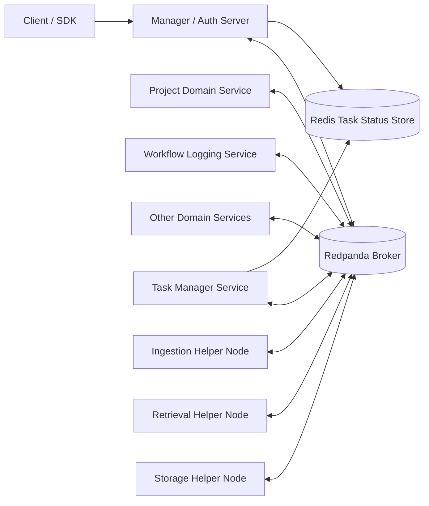
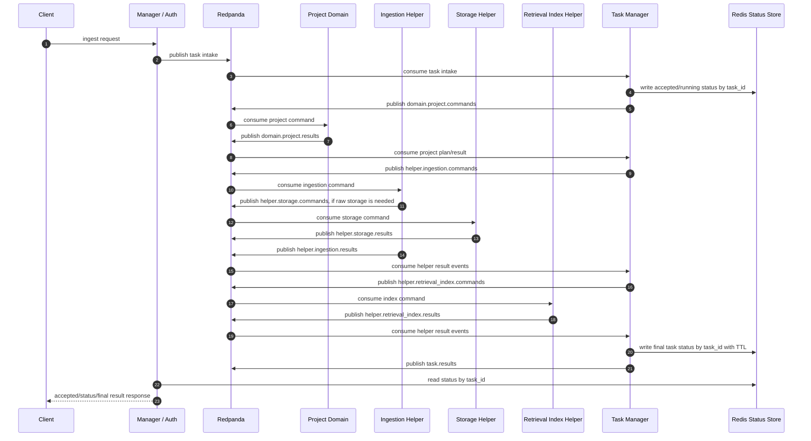
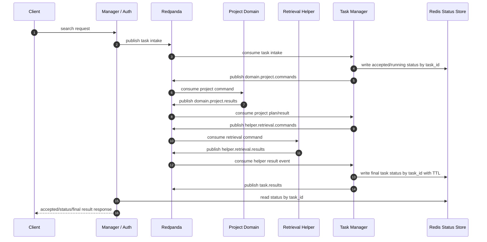
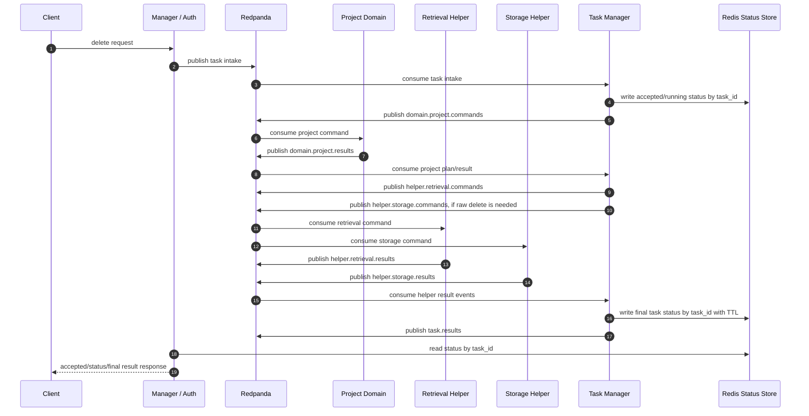
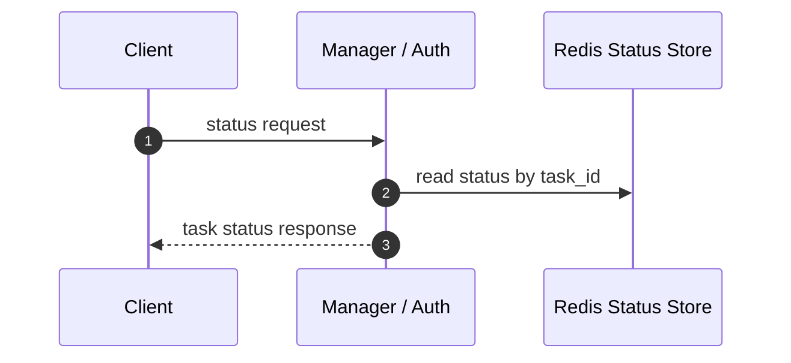
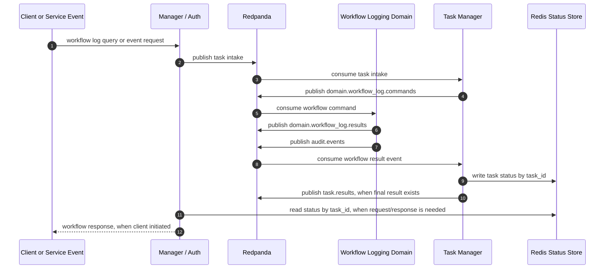
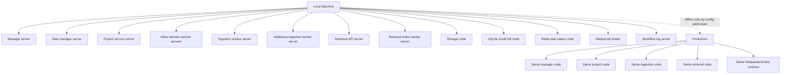

# Development Progress

Reviewed: 2026-06-24

## Overall Progress

| Area | Progress | Completed | Missing |
| --- | ---: | --- | --- |
| Architecture standard | 80% | Target broker-first independent-server topology is documented in `structure.md`, `docs/architecture.md`, and `docs/development.md`. Service folders, shared broker contracts, worker entrypoints, local runner defaults, live infrastructure validation, and deterministic integration flows now reflect the target direction. | Final service-process parity validation and removal of historical compatibility modules/docs remain. |
| Service workspace boundaries | 90% | Top-level workspaces exist for manager, broker, task manager, project, workflow log, ingestion, retrieval, Redis status, storage, and SQLite node. Each has a service-owned test folder, config/runtime boundary, worker/app context, and import-boundary coverage for current independent modules. | Legacy compatibility packages and older cross-cutting phase tests remain for migration coverage. |
| Shared contracts | 95% | Message envelope, schema-version guard, topic constants, dead-letter topic, producer/consumer protocols, typed task-intake/domain/helper/task-result/dead-letter payload contracts, domain/helper failure metadata, domain-topic helpers, task-status enum/record contracts, and validation tests exist under `shared/contracts`. Manager, task manager, and current domain/helper handlers build broker payloads through typed contracts. | Contract coverage is not yet complete for every final storage/database ownership payload. |
| Broker service | 94% | Redpanda/Kafka encode/decode adapter, strict settings validation, deterministic earliest-offset consumer startup for new groups, bounded consume timeout support, producer, consumer, aiokafka-compatible admin topic creation, tolerant lifecycle wrappers, configured-topic message bus, required-topic bootstrap, health payloads with required/missing topic details, optional lag target parsing/reporting, settings, factory helpers, broker tests, Docker local runner startup, deployment readiness command coverage, and passing opt-in live smoke coverage exist. | Service-process readiness remains broader than broker readiness. |
| Manager service | 96% | Manager normal runtime now requires broker-first task publication and explicit task-status lookup. Direct project-client execution is blocked unless an explicit compatibility flag is used, local compatibility composition is isolated in `local_runtime`, deployment composition wires Redpanda/Redis, broker-first manager process entrypoint exists, local runner defaults to broker-first, and passing opt-in live smoke coverage proves manager publishes task intake and reads Redis status through runtime adapters. | Remaining compatibility gRPC proto/generation paths still exist for migration tests. |
| Task manager service | 94% | Independent package, settings, multi-topic server context, process entrypoint, dispatcher, SQLite-backed durable task-state repository wired into runtime composition, in-memory test repository, intake dispatch, typed domain/helper/task-result/dead-letter publication, workflow-log domain finalization, ingest follow-up dispatch to storage and retrieval-index helpers, delete dispatch to retrieval and storage helpers, fan-in result tracking, aggregate helper results, idempotent helper final-result publication, retryable helper republish, terminal helper dead-letter publication, failure metadata preservation, typed status writes, completion TTL usage, final task-result publication, and runtime health payloads exist. | Active gap: validate live Redpanda/Redis app startup and expand timeout handling beyond result-driven failures. |
| Project domain service | 82% | Planning, project task logic, capability clients, domain server context, broker domain handler, Redpanda-backed domain app factory, project-owned domain settings, config examples, runtime health payload, and default planning stack wiring for ingest/search/delete project-document commands exist. | Needs live Redpanda validation and later removal of compatibility project app paths. |
| Workflow log service | 82% | Repository, consumer model, local service app, broker domain handler, owned domain settings, durable SQLite default app, process worker context, config docs, Redpanda-backed workflow-log domain server/factory for append/list commands, and task-manager query/result finalization exist. | Needs live Redpanda validation, operations readiness, and eventual removal of legacy queue/local app paths after broker-first runtime is complete. |
| Ingestion helper service | 90% | Source handling, parsing, cleaning, chunking, job records, preparation metadata, broker ingestion runtime, raw storage follow-up planning, worker/server surfaces, broker helper handler, Redpanda-backed ingestion helper server/factory, and normal broker-first worker process path exist. | Needs live Redpanda validation and eventual removal of legacy queue compatibility after final runtime parity. |
| Retrieval helper service | 90% | Retrieval, indexing, explicit HTTP/queue compatibility transports, placement, cache scoping, search/delete/raw contracts, broker-first retrieval worker, broker-first retrieval-index worker, broker helper handlers, and Redpanda-backed helper server/factories for retrieval and retrieval-index topics exist. | Needs live Redpanda and multi-Qdrant validation, reindex/migration orchestration, and eventual removal of compatibility retrieval runtime paths. |
| Retrieval placement | 85% | Placement models, routing policies, registry/repository, primary/replica writes, read failover, fanout merge, delete handling, and placement-scoped cache keys exist. | Needs reindex/migration orchestration and live multi-endpoint smoke coverage through the final broker-driven retrieval runtime. |
| Redis status node | 74% | Shared task-status contract, in-memory test store, Redis client with ping/TTL helpers, config folder, worker context with real ping health, Docker local runner startup, readiness command coverage, passing live Redis TTL smoke, and tests exist. | Needs process startup smoke and strict status-only ownership in final deployment. |
| Storage node | 66% | Top-level node package, storage configs, filesystem storage service, broker storage helper handler, plan-level storage operations, Redpanda-backed storage helper server/factory, process entrypoint context, local readiness write check, ingestion raw-storage follow-up integration, delete fan-out integration, and service tests exist. | Needs backend selection beyond filesystem, live broker validation, and eventual removal of retrieval-owned raw storage compatibility. |
| SQLite DB node | 68% | Top-level package, config examples, SQLite node service for owned database root/path allocation, `_sqlite_node.db` control-plane metadata, database registry, schema-version tracking, allocation audit history, health-check snapshots, process entrypoint context, local readiness allocation/schema/health check, broker-first runner path allocation for service metadata stores, and tests exist. Service business tables remain in service-owned databases. | Needs broader service-process validation and removal of shared/private SQLite file assumptions during final compatibility cleanup. |
| Config layout | 74% | Service-specific config folders exist for manager, project, ingestion, retrieval, workflow log, broker, Redis, storage, SQLite, Qdrant, embeddings, and generation. | Remaining shared profile settings must be reduced, and runtime loaders must consistently consume service-owned config only. |
| Test layout | 87% | Service-owned tests now live under broker, manager, task manager, project, workflow log, ingestion, retrieval, Redis, storage, and SQLite folders. Low-value migration-location assertions, duplicate factory call-order snapshots, runner wording snapshots, and compatibility-heavy direct-client tests were removed. The suite now keeps focused contract, import-boundary, broker-first integration, worker/app wiring, deployment readiness, opt-in live manager broker/Redis smoke, and core domain behavior coverage. | Older phase tests remain flat because they are cross-cutting legacy coverage. Live Redpanda/Redis/service-process smoke tests still need external infrastructure execution. |
| Local runner and deployment | 86% | Local scripts default to broker-first topology settings, Docker Redpanda/Redis/Qdrant startup or verification, infra-only broker/Redis validation, topic bootstrap, Redis TTL verification, broker/storage/SQLite/Qdrant readiness command, stop handling for infra containers, deployment composition helpers, broker-first process entrypoints, runner wiring, runtime health payloads, and operations runbook coverage for manager, task manager, project, workflow log, ingestion, retrieval, retrieval-index, storage, SQLite, Redis status, and Qdrant exist. Legacy local runtime composition is explicit behind `--compat-local`. | Needs live end-to-end smoke validation and public per-service readiness endpoints beyond dependency/process checks. |
| Production readiness | 51% | Core RAG behavior, broker-first service pieces, process entrypoints, broker-first default local runner, passing live broker/Redis smoke tests, runtime health payloads, dependency readiness command, docs, focused tests, deterministic broker-first integration flows, and operations runbook exist. | Missing full service-process end-to-end smoke, fuller observability/metrics emission, deployment runbooks per environment, and historical compatibility module removal. |

## Steps

| Step | Topic | Implementation | Acceptance Standard | Status |
| ---: | --- | --- | --- | --- |
| 1 | Lock progress and development rules | Keep `docs/development.md` as the rule source for progress structure and require `progress.md` to be generated from inspected code, configs, tests, and docs. | `progress.md` has only Overall Progress, Steps, and Graphs, and future work follows the ordered step table. | Complete |
| 2 | Stabilize independent workspace baseline | Ensure every server/node has a top-level package, service-owned config folder, service-owned tests folder, runtime entrypoint or app context, and import-boundary tests. Move flat tests into service folders incrementally. | Manager, broker, task manager, project, workflow log, ingestion, retrieval, Redis, storage, and SQLite each have owned config/tests/runtime boundaries; no service imports another service's internals. | Complete |
| 3 | Complete shared broker/status contracts | Finish envelope, topic, command/result payload, status record, schema-version, and validation contracts for every current domain/helper/storage/status path. | Services import only shared contracts for cross-service messages/status. Valid and invalid messages are covered by contract tests. | Complete |
| 4 | Prove live broker and Redis foundation | Keep the existing Redpanda adapter and topic bootstrap, then add real local Redpanda and Redis startup/dependency checks, live publish/consume coverage for the canonical topic set, and Redis status TTL verification. | A local infrastructure smoke test can bootstrap topics, publish and consume real Redpanda envelopes, write/read Redis task status, and prove completed status TTL behavior using the same adapters used by runtime services. | Complete |
| 5 | Make task-manager fan-in durable | Replace runtime fan-in dependence on optional in-memory state with a task-manager-owned durable repository, wire it into `task_manager_service.app` and deployment composition, and cover restart/replay behavior. | Broker-first task manager persists expected helpers, completed helpers, failed helpers, follow-up helper plans, and aggregate helper results across process restart, then publishes exactly one final task result. | Complete |
| 6 | Finish task-manager failure semantics | Define retryable vs terminal helper/domain failures, attempt metadata, timeout handling, and dead-letter publication contracts for the current broker topics. | Failed or timed-out domain/helper work updates Redis status deterministically, emits repairable context, avoids duplicate final results, and is covered by valid/invalid contract tests. | Complete |
| 7 | Validate manager broker-first runtime | Keep direct project-client execution only behind explicit compatibility mode, then validate manager startup against live Redpanda task publishing and Redis status lookup. | In normal local/prod mode, manager publishes task intake through Redpanda, reads status only through Redis, rejects direct project-document clients, and passes a live broker/Redis smoke test. | Complete |
| 8 | Validate project and workflow domain servers | Run project and workflow-log as independent Redpanda consumers/producers with owned config and durable stores, then remove domain-server startup gaps. | Project and workflow-log services start as separate processes, consume only broker commands, publish typed domain results, and pass live Redpanda smoke tests without embedded manager/project shortcuts. | Pending |
| 9 | Validate ingestion helper runtime | Run ingestion through the broker-first helper path with raw-storage follow-up publication and retrieval-index follow-up publication under live Redpanda. | Ingestion consumes helper commands from Redpanda, stores job/preparation metadata in its owned store, publishes storage/index follow-ups only through broker contracts, and has no normal-runtime local queue shortcut. | Pending |
| 10 | Validate retrieval and retrieval-index helpers | Run retrieval search/delete and retrieval-index helpers through live Redpanda and Qdrant, including placement-scoped reads/writes and delete fan-out. | Retrieval helper and retrieval-index helper consume broker commands, operate against configured Qdrant endpoints, publish typed helper results, and pass live single-endpoint and multi-endpoint smoke coverage. | Pending |
| 11 | Strengthen storage and database node ownership | Finish storage backend selection, wire SQLite node allocation into service metadata stores, and remove direct shared/private SQLite file assumptions from normal runtime. | Storage and database access happen through owned node/service boundaries or explicitly owned service stores; no service reads another service's private files or SQLite databases. | Pending |
| 12 | Rewrite local runner for real production parity | Make the broker-first runner start or verify Redpanda, Redis, Qdrant, manager, task manager, project, workflow log, ingestion, retrieval, retrieval-index, storage, and SQLite as real processes with readiness waits. | `examples/local/run-all.sh --broker-first` uses the same service code paths as production and fails fast unless broker topics, Redis, Qdrant, and all service readiness checks pass. | In progress |
| 13 | Add true broker-first integration coverage | Expand `tests/integration/` beyond in-process fakes to cover ingest/index, search, delete, status, workflow log, fan-in restart, topic bootstrap, Redis TTL, and storage/database boundaries through public APIs or process/broker boundaries. | Integration tests exercise live or production-style Redpanda topics, Redis status, process boundaries, and public APIs instead of cross-importing service internals for the behavior under test. | In progress |
| 14 | Add operations readiness | Add structured logs, health/readiness endpoints or commands, Redpanda topic lag checks, Redis/Qdrant/storage checks, metrics events, and environment-specific deployment runbooks. | Operators can start, inspect, troubleshoot, and validate every service/node in local and production-equivalent deployments with concrete health, lag, dependency, and task-status signals. | In progress |
| 15 | Remove compatibility scaffolding | After replacement paths pass live smoke and integration coverage, remove legacy `RagService` runtime composition, direct service clients, SQLite/in-memory queue substitutes, duplicate schemas, import shims, and local-only behavior. | Normal runtime contains only independent servers/nodes communicating through Redpanda, with Redis limited to task status and storage/database access behind owned boundaries. | Pending |

## Graphs

### Target Architecture Graph

### Ingest And Index Task

### Search Task

### Delete Task

### Status Task

### Workflow Log Task

### Required Runtime Shape

