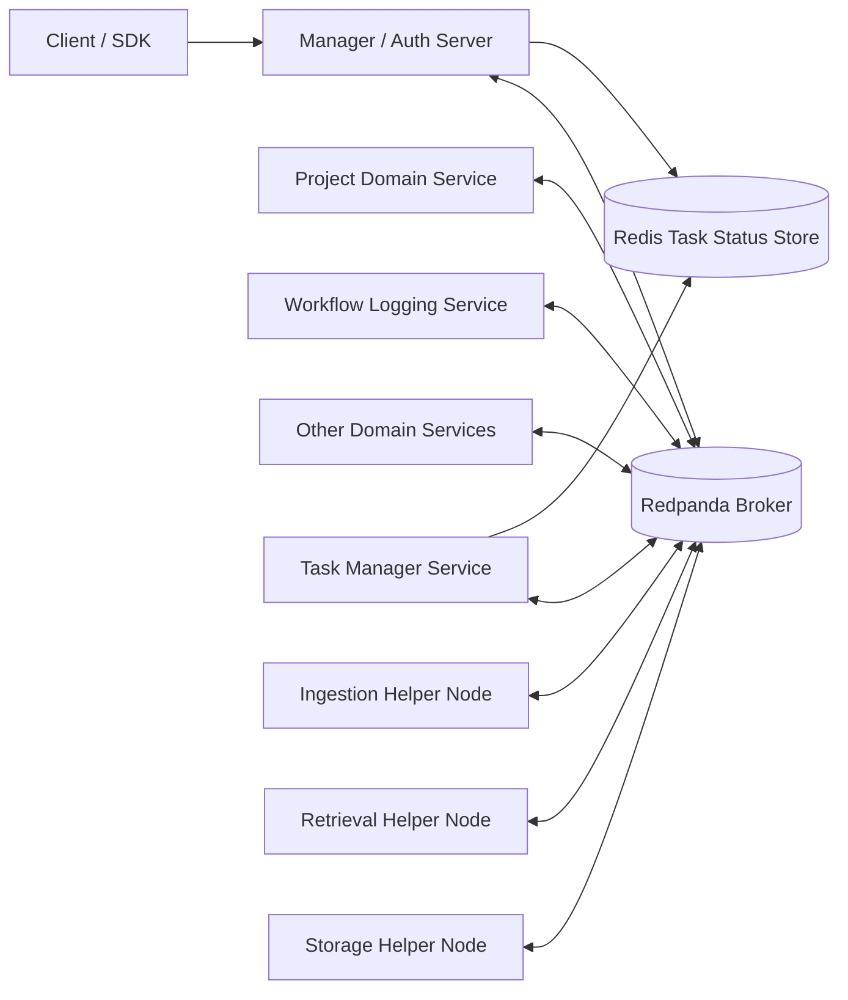
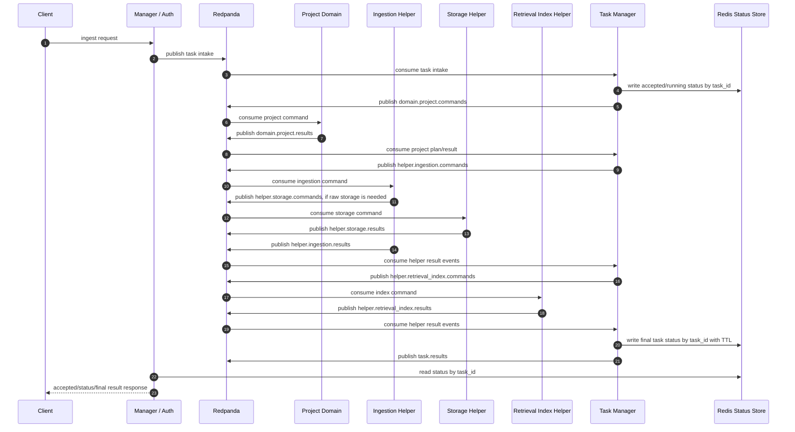
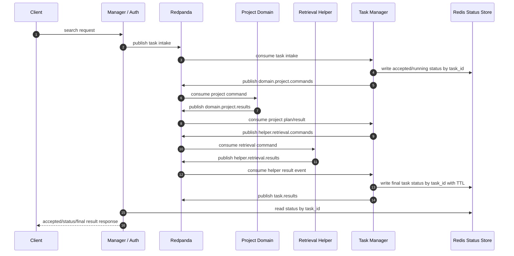
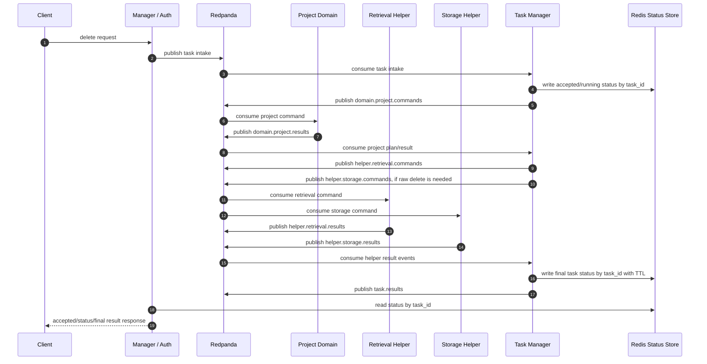
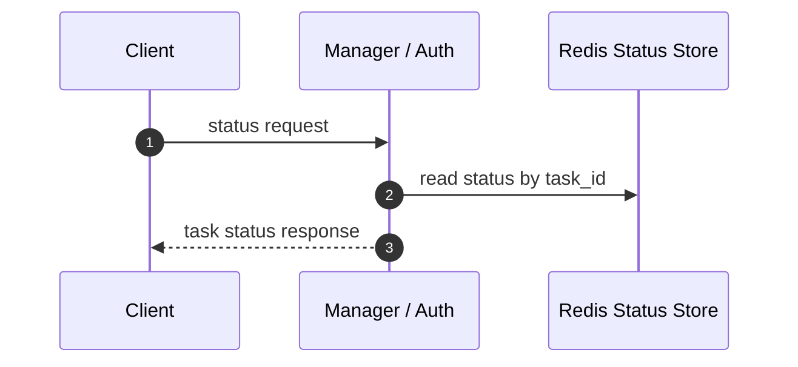
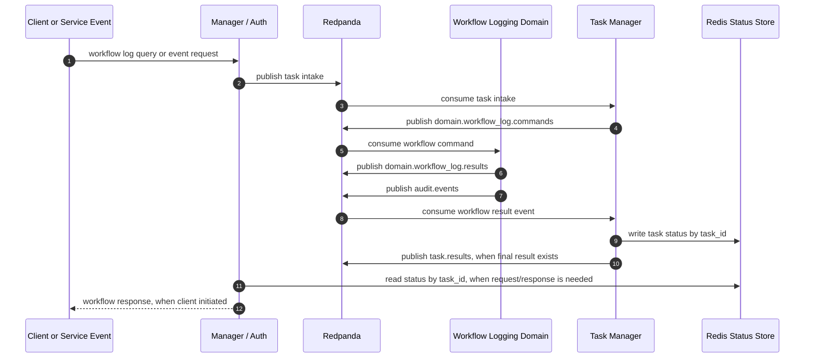
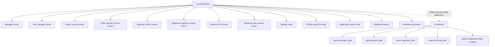

# Development Progress

Reviewed: 2026-06-24

### Target Architecture Graph

### Ingest And Index Task

### Search Task

### Delete Task

### Status Task

### Workflow Log Task

### Required Runtime Shape

